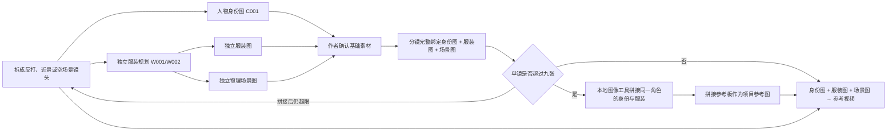

# 人物身份、服装与场景工作流

代码规范：`asset-sheets-v4`。专业节点流程：`author-brainstorm-v6`。节点来源和调用配置见 [专业 Skill 节点绑定](node-skill-bindings.md)。

## 实际执行链



画风、身份、服装和场景现在由四个专业节点分别调用，保存为 `style_plan`、`character_plan`、`costume_plan`、`scene_plan`。`identity_plan`、`wardrobe_scene_plan` 是验证后的聚合检查点，兼容历史恢复，不代表共用两个模型节点。角色进入绑定 Picsart Persona Skill 的 `character_prompts`；服装与场景进入 `asset_prompts`。所有批次与素材编号检查通过后才创建图片任务。

人物身份记录只有外貌规格。服装记录保存独立的服饰结构及 `character_ref` 关系。红裙与白裙是两个服装记录，共用一个人物身份编号；服装图不包含穿着者或人脸。

作者确认身份、服装、场景后直接进入分镜。模型按权威映射完整列出每个入镜人物的身份图、对应服装图和一张场景图，不自行猜测或创造素材 ID。同镜不能把同一身份的两套服装当作两个人物。

参考视频模型每镜最多接收九张参考图片，因此不再生成任何中间镜头图（已删除镜头参考图步骤）。分镜直接绑定该镜所需的身份图、对应服装图和一张场景图，这些原图作为项目参考图提交。只有完整绑定超过九张时，调用方才用本地图像工具（PIL 左右并排，`derived_without_model`）把同一角色的身份图与服装图拼成一张参考板，拼接板本身就是素材库中的项目参考图；拼接后仍超九张的多人内容通过反打、近景或空场景拆镜。任何拼接都不调用生图或改图接口。

提示词只按用途点名项目参考图，不解释图片版式，也不写“不要融合图片”“不要把两栏画成两个人”一类合并或防止合并的说明；拼接参考板的说明在素材库中保留给作者查看，模型侧只收到“输出为同一人物穿着这套服装”。

## 依赖与版本

- 依赖记录保存资产 ID、版本、不可变图片快照和文件摘要。
- 相同身份与服装版本的本地拼接参考板可直接复用；修改任一源图版本后，旧拼接依赖立即失效，其他人物、服装与场景原图不受影响。
- 拼接参考板创建和复用前都核验依赖；身份或服装改变时停止使用过期结果。
- 前期设定保存源依赖，分镜和后续视觉校验沿用它们。已进入后续制作的资产变更仍需重新审核，不能把旧镜头当作有效新版本。
- 模型提交结果不确定时保留记录并停止，不自动重发。规范变化不能重放旧版叙述式提示词。

## 按意见修改与视频参考

修改成功后，素材卡片与当前预览显示新图片。再次修改从最新结构化规格继续修订，旧文件与原请求保留在历史记录中。完整素材快照与实时任务进度分别记录时间，后到的完整快照仍可更新素材卡片，实时进度不会把新图片替换信息丢掉。

基础素材的「按意见修改」不再调用图片编辑模型。流程先由人物、服装或场景修订节点更新完整静态规格，再把修订后的规格、固定展示版式和完整画风交给对应的角色或非角色提示词节点，生成一条独立可用的新图 Prompt，最后调用普通生图模型重新生成。旧图片不进入请求；即使规格中的目标属性没有变化，也会根据最新完整规格重画一次。请求完成只代表图片已返回，实际效果仍由作者查看确认。

完整重做 Prompt 必须继续包含媒介、线稿、明暗技法、明度关系、边缘处理、纸面肌理、目标颜色与全部静态属性，不能写成「参考原图」「局部编辑」或「其余不变」。角色重做仍经过 `character_prompts`，服装和场景重做经过 `asset_prompts`。调试区显示本次意见、实际请求模型和实际提交的完整 Prompt。

人物身份图、独立服装图、场景图直接作为镜头参考，不再经过任何生图或改图步骤。视频请求冻结该镜实际绑定的参考图片（必要时是本地工具拼接的参考板），按固定顺序提交为 `reference_image`；统一视觉规范在请求里出现一次，构图由分镜的构图说明描述，运动由运动 Prompt 描述。作者对视频提出修改时，`video_revision` 会把意见整合进完整视频 Prompt 并新建视频任务；旧视频不作为编辑输入。供应商图片数量与请求体限制在提交前检查。接口定义见 [MiniMax H3 参考视频模式](https://platform.minimax.cn/docs/api-reference/video-generation-v2-create)。

新分镜输出 `reference_prompt`，旧分镜的 `first_frame` 字段仅保留读取兼容。历史快照保持原始记录，新任务记录 `input_mode=reference_images`；视频请求不发送 `first_frame` / `last_frame` 角色。

## 返回步骤与重新测试

作者页进度条支持点击当前及已完成的步骤，也支持浏览器前进、后退。返回步骤只切换查看位置，可以修改风格输入，不会自动发起制作或改变实际进度。

提交「重新测试」后建立独立制作轮次：保留选定原文和本次风格，从形象准备开始重新执行。原轮次的人物、服装、场景、定装、试拍、分镜、历史镜头图、视频、确认及发布结果全部失效，不能被恢复任务或素材引用带入新轮次；旧发布版本也从当前读者目录移除。历史文件与制作记录保留在「历史制作」中。

当前制作仍有任务运行时，可以返回查看，需等待任务结束后再重新测试。每轮使用独立的 `run_id` 和导演项目；旧轮次迟到的进度响应不会覆盖当前轮次。

## 单张图片失败恢复

基础素材阶段遇到供应商明确拒绝的图片请求时，作者页提供「补齐失败图片」。重试复用该图片已保存的提示词和规格，仅替换失败任务，保留其他人物、服装、场景及前置设计；图片补齐后自动回到确认图片。旧失败请求保留在任务历史，不能重复恢复、跨轮次恢复或被当成当前失败项反复调度。

HTTP 错误保存脱敏的供应商说明、错误码及请求编号。402 提示欠费或额度不足，429 提示限流，451 提示服务商拒绝请求且不推断为欠费。旧任务没有原始响应时明确标注。网络中断、超时或 5xx 等结果仍不确定的调用不会通过这个入口再次提交，也不会自动重试。

## 提示词职责

`backend/prompts/asset_visual_spec.md` 是运行时代码直接读取的内置规范。

`backend/visual_specs.py` 用结构化模型约束专业画风与静态物理属性；`backend/asset_sheets.py` 从允许字段生成提示词。`facts`、`adaptation_notes`、人物姓名、剧情气质及任意模型自写 `prompt` 都不进入生图请求。

统一画风示例：

```text
成像媒介：二维数字蘸水笔勾线
线稿工艺：外轮廓粗线、内部结构细线、笔压粗细变化
明暗技法：两阶硬边赛璐璐阴影
色板：主色 #29363D 60%；辅色 #B6B9AA 30%；点缀色 #A82E37 10%
饱和度：低饱和度
明度关系：高明度对比、暗部保留层次
边缘处理：锐利清晰边缘
画面肌理：细颗粒绘图纸纹理
```

人类人物属性为年龄外观、身高、头身比、体型、脸型、肤色、眼形/瞳色、发型/发色和固定特征。非人角色另以整体构型、身体本质、头/躯干/臂手/腿足分区、连接边界和各区体表锁定人身、兽身或妖身。服装属性为品类、颜色、材质、裁剪和结构细节。场景属性为空间尺度、表面、固定布局和光源参数。

结构校验与明显叙事/含糊表达检查用于阻止不合规请求；它们不能替代作者对图像中的人脸、体型和服装效果的视觉验收。

## 参考来源

参考公开的 [OpenAI imagegen 提示词规范](https://github.com/openai/codex/blob/main/codex-rs/skills/src/assets/samples/imagegen/references/prompting.md) 对主体、媒介、材质、构图和约束的分离方法，以及 [Black Forest Labs 风格与光照指南](https://docs.bfl.ai/guides/prompting_unified_style) 的具体光源描述维度。本项目另行实现字段白名单、依赖图和版本校验，运行时无需外部 Skill 或在线检索。
