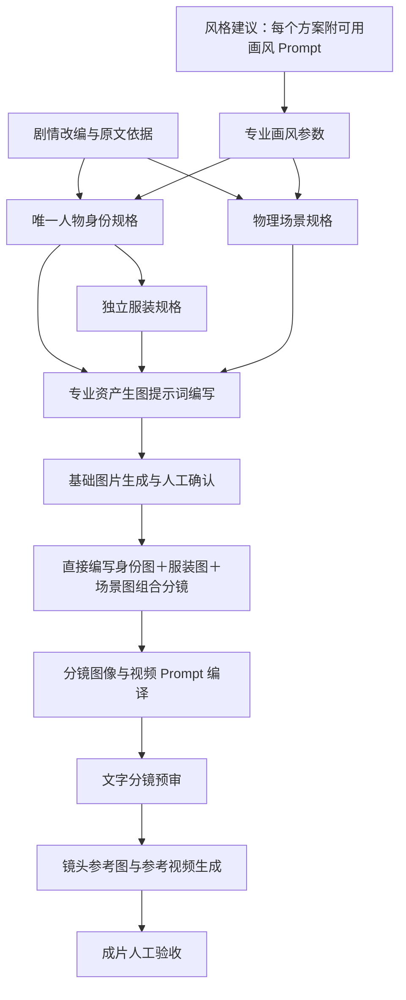

# 专业 Skill 节点绑定

流程版本：`author-brainstorm-v6`。项目节点适配版本：`1.4.3`。

## 实际调用路径

设计模型只输出规格，`asset_prompts` 是独立的模型节点，接收已经通过校验的静态描述和固定版式，输出最终生图 Prompt。原文、剧情气质、事实说明和改编备注不会传入这个提示词写作节点。

分镜规划和提示词编译也分别调用：`storyboard` 产出镜头计划，`shot_prompts` 只能更新对应镜号的镜头参考图与单镜运动文字，不能改写事件、资产、身份或时长。随后由 `storyboard_review` 做文字预审；真实画面由作者验收。

## 节点及专业来源

| 节点 | 专业能力来源 | 输出 |
| --- | --- | --- |
| style_options | Replicate prompt-images | 风格名称、剧情气质、适配原因、独立画风 Prompt |
| story_treatment | structure-screenplay + shape-story-blueprint | 有原文依据的剧情阐述 |
| style_spec | Replicate prompt-images | 专业画风参数 |
| identity_spec | design-production-assets | 唯一人物身份 |
| costume_spec | design-production-assets + prompt-images | 独立服装及身份绑定 |
| scene_spec | design-production-assets + prompt-images | 静态物理场景 |
| asset_prompts | prompt-images + compile-generation-prompts | 逐项生图 Prompt |
| identity_revision / costume_revision / scene_revision | design-production-assets + prompt-images | 按意见修订完整静态规格，再交给 asset_prompts 重新生图 |
| shot_revision / video_revision | compile-generation-prompts | 把意见整合进完整镜头图或视频 Prompt，创建新的生成任务 |
| fitting | prompt-images 的参考图一致性方法 | 定装参考合成请求模板；新流程不再调用 scene_trial |
| storyboard | plan-camera-shots | 机位、动作、连续性、时长和资产绑定 |
| shot_prompts | compile-generation-prompts + prompt-images | 镜头参考图 Prompt、视频运动 Prompt |
| storyboard_review | plan-camera-shots 的预检规则 | 文字预审结论和具体问题 |
| frame_render / video_render | compile-generation-prompts | 生成请求编排模板 |
| asset_review / film_review | 资产检查与 review-and-assemble | 作者查看真实素材后执行的验收清单 |

人物、服装和场景修订另有各自的绑定，不共用一个全能角色。

## 源文件与运行机制

- `backend/node_skills/vendor/`：上游 Skill 原文件、相关参考/Schema 与许可证，未直接导入第三方执行脚本。
- `backend/node_skills/vendor-lock.json`：固定提交版本和逐文件 SHA-256。
- `backend/node_skills/adapters/*/SKILL.md`：按节点缩小职责，适配项目的 JSON Schema、输入边界与现有模型。
- `backend/node_skills/registry.json`：每个节点的专业来源、实际加载章节、允许输入和输出格式。
- `backend/skill_runtime.py`：读取绑定、校验源文件、冻结任务使用的 Skill、记录实际调用、保存并复用相同请求结果。

这里是上游专业 Skill 加项目适配层，不照搬上游的外层结果信封、供应商选择操作或执行工具。模型和账号仍由项目配置指定。参考规范只加载与当前节点有关的章节，角色/服装/场景的结构约束分别加载。

提示词批处理只用于控制单次输出体积，不限制总模型调用次数。所有批次完成并核对素材编号后才派发生图任务；不一致或缺失的结果会保存并停止，不会按错误编号生成素材。

同一任务在首次使用节点时保存 Skill 内容快照；已有完成结果按任务、节点、Skill 摘要与输入摘要复用。修改节点配置不会偷偷改写已运行任务的规则或历史素材。

## 页面与调试

- 制作页的“查看工作流节点与专业 Skill 绑定”显示配置表。
- 各任务的“本任务专业节点”显示真实调用、返回/失败/复用状态、Skill 来源与摘要。
- 素材下方显示实际 Prompt 及其编写/编排节点。
- 新风格建议带可复制 Prompt，选用后填入可编辑的“画风提示词”框。
- `GET /api/node-skills` 返回绑定目录；`GET /api/node-skills/{node}` 返回该节点生效的专业方法和项目适配契约。

配置表不代表历史任务执行过这些 Skill。旧素材保持原提示词与原记录；新建或重做任务采用新节点，历史已完成任务不会被补写虚假的调用记录。

## 上游来源

- [Replicate prompt-images](https://github.com/replicate/skills/blob/2f36e415965ae63baa1c9f6635888092bcd771d3/skills/prompt-images/SKILL.md)：Apache-2.0。
- [film-production-skills](https://github.com/zhangzhangco/film-production-skills/tree/47b2a6a432235e716fa2aa0d08eefae76fdb34fd)：MIT。

源码版本和许可证一并保存在项目中，运行时不需要在线搜索或安装全局 Skill。
