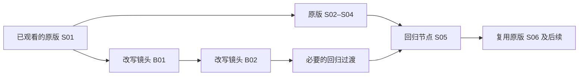

# 可替换分镜、主线回归与逐段生成设计

日期：2026-09-13。状态：研究与设计提案；未接入 fal，未发起收费模型调用。接口信息来自当日公开官方文档，延迟、可用权限、画面质量与衔接效果尚未账号实测。下文的数据结构、调度参数和验收目标是本项目的建议，不是供应商承诺。

## 产品与选型结论

作品的运行形态应为带版本的分镜图与播放清单。原版镜头是可复用文件，读者改变当前尚未发生的一小段，系统生成必要的分支与过渡，然后接回满足条件的原版节点。单文件视频可作为导出结果，不作为互动运行时的唯一载体。

优先验证短片段接口与自建播放调度。它与独立镜头标识、素材复用、局部替换、回看和算力控制直接匹配。Director 作为连续长镜头实验路线：其流式体验有价值，但可复用文件、切点、分段录制、回放和接回已生成原片仍需应用实现。

懒加载分为三个层次：

| 层次 | 可行性与实际含义 |
| --- | --- |
| 不等整部作品下载 | 按播放位置下载已有片段；本项目可实现 |
| 不等整条改写分支生成 | 第一镜通过必要检查后先播放，同时生成后续镜头；本项目应实现 |
| 单个任务未完成就播放其生成帧 | 必须有供应商媒体流协议；不能由队列进度、SSE 或视频切片自行获得 |

fal 普通 H3 系列按任务返回完成的视频；Director 返回 WebRTC 音视频流。fal 通用 SSE 仅对声明支持流式输出的端点生效，事件也可能只有进度与最终结果。[Director 产品说明](https://fal.ai/h3-max-director)、[fal Streaming](https://fal.ai/docs/documentation/model-apis/inference/streaming)。

## 当前接口能做什么

| 服务 | 已核对的能力 | 对本项目的含义 |
| --- | --- | --- |
| MiniMax 官方 V2，MiniMax-H3-Max | 5–15 秒；480P/768P；首尾帧；不支持参考素材模式 | 能生成局部桥接片段，但不能直接把多张角色图、场景图与首尾帧混传 |
| MiniMax 官方 V2，MiniMax-H3 | 支持参考素材模式；参考模式与首尾帧模式互斥 | 需要在素材一致性与精确边界约束之间选路 |
| fal，minimax/h3-max-turbo/image-to-video | image_url、end_image_url；返回 video 文件 | 适合首帧起步、尾帧接回的短片段实验 |
| fal，minimax/h3-max/reference-to-video | 角色/风格图片及视频、音频参考 | 可直接验证素材绑定；公开输入未列首尾帧字段，不能假设兼得 |
| fal，minimax/h3-max/director | 实时媒体轨、初始帧、结束帧、按时间编排 script、替换待执行方向 | 可实验连续分支与指定画面收束；没有因此自动完成剧情状态校验或原片复用 |

依据：[MiniMax V2 创建](https://platform.minimax.io/docs/api-reference/video-generation-v2-create)、[MiniMax V2 查询](https://platform.minimax.io/docs/api-reference/video-generation-v2-query)、[fal Turbo 图生视频](https://fal.ai/models/minimax/h3-max-turbo/image-to-video/api)、[fal 参考视频](https://fal.ai/models/minimax/h3-max/reference-to-video/api)、[Director API](https://fal.ai/models/minimax/h3-max/director/api)。

命名注意：MiniMax 官方也存在 MiniMax-H3-Max；不能把它与 fal 下的 h3-max、h3-max-turbo 当成同一服务。根据供应商、具体端点、版本登记能力和测速结果。

Director 的 replan/脚本替换作用于下一个尚未派发生成的片段，接纳回执不代表观众已经看到变化。公开 configure 字段目前未列 chunk_duration，尽管产品说明及服务端消息提到分段时长；不直接发送未经确认的字段。script 的短节点规则也不能等同于任意任务支持 3 秒生成。[Director 协议](https://fal.ai/api/apps/fal-ai/minimax-h3-max-director/asyncapi.json)。

Turbo 的 fast 扩写可列入实验；当前图生视频参数说明明确描述 balanced/quality，却没有完整列明模式约束。基线使用文档明确列出的模式，记录服务端实际接受情况，再比较 fast 的延迟和质量。

## 回归必须满足两类条件



剧情条件检查人物生死、地点、道具归属、人物知道的信息、关系和动机、已作出的承诺，以及后续台词所依赖的事实。视觉条件检查服装、伤势、站位、手持物、朝向、镜头轴线、场景布局、光线、动作速度和声音。

回归不是恢复整个旧状态。读者造成的历史保留，只有复用后续镜头真正依赖的条件必须兼容。不能只检查回归镜头的第一帧：还要检查复用区间后面是否提及与新历史矛盾的事件。

例：原版为“走正门 → 拿到钥匙 → 到地下室”。改成“翻窗拿钥匙”后，可以复用地下室镜头，前提是服装伤势、钥匙、知识和后续对白都兼容。改成“烧掉钥匙”，则不能接到“掏钥匙开门”；应改用可信的其他开门路径，或继续寻找更远的回归点。若读者此前已明确要救某人，不以无解释的死亡抵消其选择。

制作原版时，为若干自然剪辑边界预先定义回归条件，并准备容易进入的承接镜头，例如人物到达后的中景、动作完成后的定镜。减少后续镜头对“之前究竟怎么来”的非必要依赖，有利于复用。保留关键因果与角色反应，避免所有选择都迅速被抹平。

运行时对有限范围内候选回归点做条件筛选，再选择预计生成秒数、首个变化等待、连续性风险与违背读者意图代价较低的路径。没有可信路径时扩大替换范围或返回冲突，不承诺任何输入都能回到同一结局。

## 分镜、视频和素材的数据关系

具体文件编码、元数据、帧坐标、不可变版本和旧数据迁移约定见[分镜视频存储规范 v1](video-storage-format-v1.md)。

叙事镜头、模型一次生成的片段、传输切片分别建模。一个镜头可能需要多个模型任务；一次生成也可能只剪用其中一段。生成 5 秒剪用 2 秒，计费与生产时间仍按实际生成计算。把文件切成 1 秒传输块不会缩短模型首次产出的时间。

建议新增或扩展：

| 对象 | 核心内容 |
| --- | --- |
| StoryRelease | story_id、release_version、世界规则、原版分镜图、素材快照 |
| ShotSpec | 稳定 shot_id、revision、剧情目的、前置条件、预期事件、后置条件、连续性信息、可切点 |
| AssetBinding | 角色/服装/场景/道具/声音的 asset_id 与版本、引用角色、文件摘要 |
| ClipArtifact | 独立 clip_id、来源 shot_id/revision、模型任务、视频地址、真实时长、剪辑区间、首尾帧、质检状态 |
| RejoinAnchor | 下游 shot_id、叙事条件、视觉/声音接入条件、后续依赖、可接受差异、目标画面 |
| BranchPatch | session_id、base_release、branch_version、替换起止位置、用户意图、候选回归点、新镜头计划 |
| PlaybackManifest | 清单版本、当前片段与偏移、不可更改的已看前缀、已就绪后续、待生成占位和任务状态 |

镜头身份由业务 ID 与版本确定，不靠文件名或可变顺序索引。ID 保存在清单和媒体旁的元数据中，读者播放器可以显示“镜头 03 / 分支 B”；不必烧录到画面而影响复用。

每个镜头保存两个状态概念：计划中的事件与经过画面检查的事件。时间线状态只提交观众实际看到的已验证事件，不能在任务完成或计划产生时提前更新。原版发布阶段校正事件时间；新分支的事件时间与质量若无法确认，应限制互动粒度或暂停，不以预测时间冒充画面事实。

同一原片供多个会话共享，修改只覆盖当前会话的播放清单。发布版本和历史素材不原地覆写。并发回包必须同时匹配 session_id、branch_version、分镜版本和素材摘要；过期结果不得接入当前播放。

## 素材绑定与视频生成选路

优先采用已有画面起步：分支第一镜以实际切出点的画面为首帧，动作提示明确读者要求。这样能省去每次先生成一张图片的串行等待。若新剧情需要当前画面外的新角色或环境，再生成受参考素材约束的关键帧。

多图需求不应一律变成每镜多图生图再生视频。逐镜选择：

1. 已有匹配镜头：检查状态和素材版本后直接复用。
2. 同场景动作变化：现成首帧加动作提示生成视频；需要时提供可达的尾帧。
3. 新构图/新角色：角色、场景、道具参考共同生成关键帧，再送入支持首尾帧的视频端点。
4. 多角色参考优先、允许切镜头：实验 reference-to-video，再检查是否能接入既定边界。

分支最后一镜可把原版回归镜头的接入画面作为目标尾帧。首尾画面必须在规定时长内物理可达；跨房间或姿势差异过大时增加过渡或选择剪辑切点。首尾图一致只约束边界，不能保证中间不换脸、不变装或动作合理，也不能保证声音自然接上。

资产缓存按语义状态、入口/出口约束、角色场景版本、画风、模型参数、分镜内容和媒体摘要建立索引。近似文本匹配只能找到候选，不直接授权复用。已完成的无效分支可以保留为候选素材；避免为小概率路径无限预生成。

## 逐段规划、生成与播放

用户在任意时刻提交。暂停模式将当前播放位置固定为分支起点；连续播放模式选择最近的合理未来切点，按切点实际会发生的历史重新校验，不能一直使用提交时的旧状态。已看过的当前镜头前半段必须保留。

建议流水线：

1. 保存改写版本与实际切出位置，从该位置重建事实；并行读取已绑定素材和邻近回归候选。
2. 让 LLM 先给出很短的分支约束与可信回归路径，以及第一镜完整规格。先检查约束与路径，再启动第一镜。
3. 第一镜生成时补全后续镜头。若采用文本流式输出，只对完整、可解析并通过校验的镜头对象派发任务；半截 JSON 不派发。
4. 首镜媒体可解码、版本正确且通过必要语义/视觉检查后推送 shot_ready；播放器立即准备它，不等整条分支。
5. 播放 B01 时生成 B02，播放 B02 时生成回归过渡；回归点通过检查后直接读取原版文件。
6. 后续生成失败或状态不兼容时，从已播放的新历史继续规划或明确暂停。不得静默播放与选择冲突的原版后续。

步骤 2 的粗路径先检查，精细分镜逐镜补全：避免首镜已经公开后才发现根本无法回归。复杂意图仍可能需要额外模型检查；文本校验不能证明生成视频忠实执行了计划。

依赖上一镜真实尾帧的下一镜必须等待该尾帧可用。事先有可靠共享关键帧、且允许剪辑切换的镜头才适合有限并行；不能为提高并发破坏连续性。

将静态世界设定、角色定义、已验证原版信息预先准备并复用，运行时只发送必要的局部状态与候选条件。DeepSeek 的前缀缓存可以减少重复上下文开销，但缓存命中和总响应时间不能保证；按实际日志统计。[DeepSeek 缓存文档](https://api-docs.deepseek.com/guides/kv_cache/)。

### 缓存与播放承诺分开

下载缓存可以保存较多原版片段，但“即将实际播放什么”的承诺窗口应短。首版从当前镜头加下一镜开始实验，根据真实延迟分位数调整。下载了原版未来 20 秒，不意味着必须把这 20 秒播放完才响应。

用户再次修改时保留已观看前缀，增加 branch_version，作废尚未播放的旧后续。能取消的排队任务尽量取消；已生成或不可取消的任务仍可能收费。旧文件不用删除，但不能进入新清单。

首版可用双视频元素交替预加载并在就绪后切换，测量浏览器上的切换空隙；它不天然保证无缝。稳定后按兼容编码、时间戳、关键帧与音轨规范生成 fMP4，使用 MSE 管理追加和未播放缓冲的移除。HLS/DASH 也可承载片段，但个人分支与低延迟切换仍依赖应用调度，不能只追加播放列表就假设立即生效。[MDN MSE](https://developer.mozilla.org/en-US/docs/Web/API/Media_Source_Extensions_API)。

画面接缝与声音分别处理：固定角色声音资产，避免在半句对白处切换，环境声/音乐根据状态连续播放或淡入淡出。关键发言如改变角色认知，必须随视频事件记录，不能只作为装饰音轨拼接。

## 延迟、算力与可验收性

输入到剧情可见包括：局部规划、必要的关键帧、视频排队与生成、编码/传输/检查、可切点等待，以及镜头中真正出现所请求动作的偏移。准备过程可并行时按关键路径计算，不能机械相加全部后台任务。

```text
T_visible = T_first_playable_changed_clip + T_wait_for_feasible_cut + T_effect_offset
```

在已经暂停的起点，切点等待可以接近零；连续播放时可能等到当前动作/台词结束。首镜若先铺垫再执行要求，即便视频开始很快，剧情可见仍然很晚。

示例仅用于解释流水线：局部规划与准备 1 秒，首个 5 秒片段生成、接收和检查共 3 秒，则可在第 4 秒开始播 B01；此时生成 B02，若也用 3 秒，会在 B01 播完前就绪。3 镜分支不必等全部生成才开播。所有数字都要用实测替代；若每镜就绪耗时持续大于实际剪用时长，少量缓存只能延缓卡顿。

fal 公布的 0.44 秒对应 5 秒 480p 文生视频的 GPU 去噪耗时，不能代入上述整条链路或图生视频。本文不采用该数字作端到端承诺。[fal 测速口径](https://fal.ai/minimax-h3-max)。

算力目标按实际生成秒数和废弃率衡量。静态主线预生成；在线只生产当前选择的必要局部镜头；优先缓存常见资产、关键帧和高命中分支，不展开整棵分支树。粗略成本为“新生成秒数 × 对应端点单价 + 必要生图 + LLM + 重试/废弃任务 + 存储传输”，不能用最终剪用时长直接估价。

先做单故事、两个角色、一个场景、两个回归点、每次约 1–3 个新镜头的实验。优先 5 秒生成片段、480p、动作明确且允许切镜。比较：首帧直出、首尾帧、额外生关键帧再视频三条路径；Director 另测会话启动、指令接纳、真正可见、回归切换和保存分镜。

小批样片排除明显不适合的路线后，对选中配置做至少 100 次覆盖片段开头/中间/末尾的修改。另覆盖连续改写、失败、过期回包和目标网络。未体现指令与失败必须计入总体结果，不能只统计成功样本。

记录 request_received、contract_validated、first_shot_validated、keyframe_ready、provider_submitted、provider_ready、media_playable、first_frame_presented、first_effect_visible、rejoin_verified 等时间，以及卡顿、角色/道具/知识状态错误、原片复用时长与废弃生成秒数。first_effect_visible 通过实际画面标注或经验证的检测确定，不能以 prompt_applied 代替。

目标可设为首个明确变化 P50 ≤ 3 秒、P95 ≤ 5 秒，首先用于测量和决策。额外生图、复杂动作与高负载单列；未达标时如实显示准备状态或暂停，不用旧剧情/循环空镜冒充修改已生效。

## 与当前代码衔接

| 当前证据 | 已有基础与下一步 |
| --- | --- |
| backend/production.py，publish | 已按 shot_id、clip_id、media、start/end 发布清单；继续保留独立片段，加回归条件与会话分支覆盖 |
| backend/production.py，save_wish；web/app/ReaderExperience.tsx | 当前只保存愿望，尚不生成/播放真实分支；新增分支任务与动态清单 |
| backend/consistency.py，image_context | 已有参考素材、资产版本和连续性状态；扩展为入口、出口和可检索回归约束 |
| backend/director.py，Shot | 已有连续性、人物认知和生成/剪辑时长；补结构化事件、依赖条件和切点 |
| backend/providers.py，chat_json | 当前服务于作者制作节点；未来若实现互动规划，应新建独立的小范围路径，不把整个导演制作流程放入实时请求 |
| backend/providers.py，submit_video | 当前视频请求只传首帧；补尾帧与供应商专用适配，不能只换 URL 接 fal |
| 新的互动领域模型 | 按每部作品、每个节点保存可检验条件与已看事件，不复用已删除的固定演示状态 |
| backend/worker.py，video 等待分支 | 未完成后等待 10 秒才可再次查询；交互任务需独立优先级、适当并发、完成通知或符合供应商限制的短轮询 |
| backend/worker.py，视频入库 | 目前完整下载、探测再入库，且待审核；需逐镜媒体就绪和质量门槛，不能仅删等待就称为实时 |
| web/app/ReaderExperience.tsx，video key={index} | 当前逐镜重建 video 元素，未预加载下一镜；改为就绪事件驱动的预加载与切换 |

先实现分镜状态与回归条件、逐镜完成通知、版本化动态清单，再接视频端点测速。原版仍经过作者制作和审片；读者在线分支需要明确的自动检查边界，不能把原有人工审片步骤计为零耗时，也不能将跳过它当成质量已验证。
