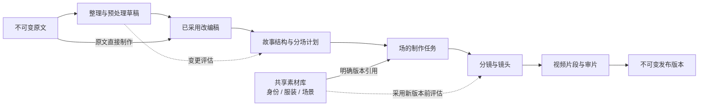

# 叙间工作台设计规范

版本：1.3 · 2026-10-03 更新 · 状态：全文荧光片段与工作区协作已回填，领域规则继续有效

本规范用于后续设计、开发与验收，不代表下面的能力已经实现。配套文件：[框架记录与后续工程安排](implementation-plan.md)。

> **当前设计入口（2026-10-03）**：[设计任务骨架](design-task-skeleton.md)。本轮已确认连续原文、整块荧光片段、动态跳转、区域实际边缘统一出线、所选对象属性、底部对话和全尺寸成片布局，完整规则见[画布设计方向第 7–11 节](canvas-design-direction.md#7-故事总控连续原文与荧光片段)。旧固定目录、常驻编辑列、「叙事画布／章节编排」双布局、固定四标签及相应断点均为历史记录，不再作为当前界面约束；本文旧呈现或流程与最新结论冲突时，以最新方向及任务状态为准。唯一归属、导入原稿保护、准确素材版本、审核及历史快照规则继续有效，详细数据契约和其余制作操作逐项补齐。

## 1. 产品定位与确定的设计方向

工作台是一个故事项目的制作空间。它需要容纳不同长度与结构的故事，支持制作前的内容处理、可复用的视觉素材、逐场制作和独立发布版本。

本轮确定以下规则：

- 基础对象是「故事项目」，页面、接口新契约和数据模型不再把「微小说」作为唯一类型。短篇、长篇、分集故事使用同一工作模式。
- 导入原稿与当前故事正文分别记录；当前正文支持修改、增补和节奏调整，形成可追溯版本，导入原稿作为历史依据保留。前台「原文」是连续全文来源视图的名称，不要求将历史原稿和当前正文常驻并列。
- 项目具有唯一的持久归属树。左侧来源区提供原文／故事片段两视图；切分／裁减、剧本、分镜、资产以无限画布组织对象，成片使用铺满主工作区的剪辑组件。顶部工作标签数量与名称继续设计，不从执行节点推导导航。
- 一个连续、非空的荧光区域对应一个故事片段。用户划选未分配文字建立候选，明确确认后进入后续制作；已保存区域不可重叠，允许边界相接。点击已有区域或动态片段项恢复上下文。
- 剧本连线从整块荧光区域实际边缘一个点延伸，经共同主干连接动作、对白等对象。右侧属性属于实际所选项目对象，每个步骤底部都有自然语言对话入口，不要求显示 Agent 名称。
- 计算节点与专业模型节点继续独立执行，在对象的制作记录中展示；执行步骤不能代替故事内容的父子层级。
- 人物身份、独立服装、场景分别管理。跨场复用已有的具体版本；换服装不会创建第二个人物身份。
- 审核针对具体对象和具体版本。取消「我已看过本轮全部内容」这类总勾选；明确区分选中、保存、确认、生成、发布。
- 每次修改先计算影响范围。历史发布版本保留快照；新版本的采用范围由用户明确选择。
- 完整提供明暗双主题：亮色以当前工作台为基准，暗色以主页为基准，同一个组件使用同一组语义和几何规格。
- F0–F4 框架已完成，本轮来源交互稿和文档确认不代表业务实现完成。详细契约与制作操作分批定稿；按实际改动验收，不将设计文档更新变成全量生产测试。

## 2. 对象关系与术语

### 2.1 项目归属树

下面表示对象归属。每个对象在当前项目树中只有一个位置；版本在对象详情中切换，不为每个版本复制一套项目树。

```text
故事项目
├── 故事
│   ├── 原文
│   │   └── 原文章节（有章节时显示）
│   └── 改编稿（采用稿、保存的草稿）
├── 制作内容
│   ├── 篇章／集（可选，可按作品需要嵌套分组）
│   │   └── 场
│   │       └── 镜头
│   └── 场（短故事可直接归属制作内容）
│       └── 镜头
├── 共享素材
│   ├── 人物
│   │   └── 人物身份
│   │       └── 独立服装（多套，每套有各自版本）
│   └── 场景素材
│       └── 物理场景
└── 发布版本
    └── 发布记录（不可变快照）
```

场的详情显示该场引用的人物、服装、场景及准确版本；引用不会在场下面再创建一份人物或服装。镜头属于一场，多个场引用同一个素材。原文章节与制作篇章／集分属不同分支，不能因为名称相同就合并为同一个对象。

### 2.2 制作依赖与版本引用

下面表示计算依赖与引用，不表示项目树的父子关系。归属树负责「对象在哪里」，引用负责「这一版用了什么」。



| 名称 | 含义与边界 |
| --- | --- |
| 导入原稿（历史原文） | 导入的原始内容及原始章节，作为历史依据留存，不原地覆盖。 |
| 当前故事正文／改编稿 | 项目当前工作使用的文本版本，可与导入原稿一致，也可修改或增补；前台原文视图连续展示这份正文，制作输入冻结明确版本。 |
| 故事片段／荧光区域 | 同一正文版本上的连续、非空来源范围，有稳定片段 ID 和候选／确认状态；片段列表和荧光区域是同一对象的两种呈现。 |
| 原文章节 | 来源文本的章节组织，用于阅读和追溯，不能自动等同于制作的集。 |
| 篇章／集 | 可选的制作组织层。一个原文章节可以跨多个集，一个集也可以引用多个原文章节。 |
| 场 | 有明确叙事目的、出场角色、主要物理场景和衔接状态的制作单元。换地点或时间通常需要分场，但由创作者确认。 |
| 镜头 | 场中的具体拍摄与生成规格，绑定人物、服装、场景的准确版本。镜头身份不由当前显示序号决定。 |
| 素材 | 人物身份、独立服装、场景等可复用资源。素材身份与素材版本分别记录。 |
| 制作任务 | 一次有确定输入版本与范围的计算操作，可以失败、重试、被新任务取代。任务完成不等于作者确认。 |
| 发布版本 | 固定的改编稿、分场、镜头、素材和视频快照，可发布完整作品或已完成的集／范围。 |

制作分支的层级：`项目 → 制作内容 → 篇章／集（可选）→ 场 → 镜头`。短故事可以直接分场，不显示空的中间层。长故事可以增加组织层，不能靠把全书塞进一个生成请求来扩展。

显示序号和标题允许调整，业务 ID 必须稳定。拆分、合并时保留来源与继承关系；调整顺序不能重新编号所有素材、镜头和媒体文件的业务 ID。

### 2.3 来源范围与片段约束

来源以正文 ID／版本和精确文字范围为依据，不能使用显示段号、标题或画布坐标代替。一个片段的范围连续且非空；已保存候选与已确认片段之间不允许重复、部分相交或包含，边界相接允许。原文保留自身段落和换行，不按这些片段插入卡片、标题或状态。

临时选区、候选建立与确认分别记录；点击已有区域用于返回，冲突时指出已有片段，不静默裁切或覆盖。增量候选允许未分配正文，完整方案提交另查明确制作范围的顺序和覆盖。AI 候选遵守同一规则，具体计数、并发校验、拆合继承与旧段落引用迁移见[范围工程边界](canvas-design-direction.md#11-精确范围契约与后续工程)。

一个完整片段可关联多个剧本对象，它们共用整块区域的来源起点。资产出现位置是次级出处，同一项目资产可跨片段共用，不将每个词语出现创建为新的故事片段。对象归属、文本映射和显示连线几何分别记录。

## 3. 项目工作模式与导航

### 3.1 项目入口

进入已有项目恢复来源视图、阅读位置、片段及步骤上下文、所选项目对象、查看版本和画布视野；成片恢复项目级剪辑。新建项目后在故事总控添加原始故事，再从连续正文划选片段。公开项目查看与个人项目恢复属于项目入口，详细职责见[设计任务 D09](design-task-skeleton.md#d09--项目入口)。

项目顶栏显示项目名与后台任务状态入口。内容区上方显示选中对象的真实归属路径；例如「静止的车站 / 制作内容 / 回家的线索 / 广播与票窗 / 镜头 02」。当前采用稿及素材版本放在对象详情中。后台任务完成不会自动跳转页面、改变选择或触发确认。

### 3.2 故事来源区、工作区与对象属性

左侧提供连续原文和动态故事片段两视图，承担全文阅读、范围划选、片段跳转和来源对照。制作任务的主体是无限画布，对象可自由拖动，空白区可平移，视野可缩放；坐标只表示布局，不改变归属、顺序或引用。

成片中，左侧来源／片段列表同时承担资源区，剪辑组件铺满右侧主工作区，资源按故事来源浏览、预览并明确插入。点击资源保持当前剪辑；重复使用创建独立实例，保留源片段、镜头和媒体版本。实例重排、裁切或删除不反写制作对象。

属性面板跟随实际选中的项目对象，展示真实归属、来源、版本和状态，不显示静态任务介绍。每步骤底部均有可自由提问的对话入口，按项目／步骤／片段／对象保存上下文及历史，不要求标明 Agent、模型或角色名称。对话处于界面层，不随画布缩放；建议、任务提交和采用分别处理。

片段切换恢复工作上下文，已提交任务持续执行，结果回到原目标且不抢焦点；项目队列可返回任务原工作位置。后续小节中的旧目录、双布局和表格位置要求作为历史记录，具体呈现以本节及最新方向为准，领域归属、审核和引用规则继续有效。

画布的父子分组表达真实归属，选中素材时叠加该准确版本的使用关系。查看人物或服装时，中央可以保留制作结构作为引用上下文，面包屑与编辑区仍明确显示素材的唯一归属，不能把高亮的多个引用场都算成当前选中对象。完整目录可按需打开，辅助任务与记录不再形成常驻第二列导航。

| 选中节点 | 主内容／局部页签 | 主要动作 |
| --- | --- | --- |
| 项目根 | 当前待办、子分支摘要、制作范围 | 打开待办对象、选定制作范围 |
| 故事／原文／原文章节 | 原文阅读、来源、对应改编内容 | 打开关联改编稿；原文正文不原地修改 |
| 改编稿 | 整理、差异、来源与版本 | 预览调整、保存草稿、采用此版本 |
| 制作内容／篇章／集 | 直接子组与场、范围、顺序、衔接、就绪摘要 | 建立分组、组织场、检查指定范围 |
| 场 | 场信息、引用、分镜、审片 | 拆分／合并／移动、确认本场结构或分镜、生成本场视频 |
| 镜头 | 镜头规格、素材引用、视频与审核、任务记录 | 修改当前镜头、确认当前分镜／成片版本、重试具体失败项 |
| 人物身份／服装／物理场景 | 规格、版本、审核、使用位置 | 确认此版本、创建新版本、采用到指定范围 |
| 发布版本分支／发布记录 | 待发布范围与就绪检查／历史快照与播放 | 创建新发布版本／回看固定版本 |

「整理故事」「分场制作」「素材审核」等是节点详情的工作方式，不是项目根下面并列的六个虚拟步骤。计算记录属于执行信息，通过当前对象或顶栏任务入口查看；不能把 pipeline 的步骤树当成项目归属树。

### 3.3 树的操作与选择规则

| 行为 | 规则 |
| --- | --- |
| 展开／收起 | 行首独立箭头控制子节点，标记 `aria-expanded`；不改变选中对象，不保存正文、不审核、不生成。无子节点不显示可展开箭头。 |
| 选中节点 | 点击节点名称打开对应详情；选中背景与审核状态分别显示。项目树中始终至多一个当前对象。 |
| 面包屑 | 反映真实父子路径，点击祖先选择该节点；不能把「原文 → 素材 → 生成 → 发布」流程顺序当作面包屑。 |
| 引用跳转 | 点击引用到素材的唯一节点并展开其祖先，可按原场／镜头入口返回。切换查看素材不会改变该场采用的版本。 |
| 选择范围 | 只在生成、采用或发布的范围编辑中启用，明确显示实际后代数量；和普通浏览选择、作者确认分开。父节点的范围选择不等于确认其全部子节点。 |
| 父节点状态 | 从子对象与实际引用依赖汇总，例如「3 场，1 场可发布，1 场引用待确认」。不把子树压成一个不可解释的「已完成」，不从父节点自动传递确认。 |
| 恢复 | 按稳定节点 ID 保存选中、展开、页签、版本；刷新、改名、重排和断点切换不丢失。节点移到新父级后恢复新路径；节点已合并／移除时定位存活祖先并说明原因。 |

目录层级用缩进、独立展开箭头与类型图标表达；画布层级用篇章容器、场卡、镜头子项和少量中性实线表达。素材版本引用用虚线及准确版本标签表达。标题允许换行或打开完整名称，不能为深层缩进或缩放把名称裁到不可识别。完整阻塞原因、任务和修改意见留在当前对象详情中。

### 3.4 归属与结构编辑约束

- 一个节点只有一个父节点；禁止环、孤立节点与重复归属。版本引用、来源映射及任务依赖可以跨分支，但不会改变归属。
- 制作内容与制作分组可以包含分组／场；场只包含镜头。制作分组允许按作品需要嵌套，不强制「卷 → 章 → 集」全部出现。不得把场移入素材分支、把镜头直接挂在项目根、把原文章节移成制作集。
- 服装属于具体人物，不能随普通树拖动改变身份归属；其使用范围由引用管理。人物和物理场景不复制到每个场下。
- 显示顺序与业务 ID 分离。移动场到另一篇章／集保留场、镜头、素材引用与媒体 ID；先预览旧／新路径、范围与衔接影响，再采用。纯改名、折叠和同层显示排序不自动使全部视频失效；叙事顺序变化要复核受影响的衔接。
- 所有结构写入由服务端校验允许的父子类型、同一项目、唯一父级、无环和预期版本，原子更新父级与顺序。不能只在前端展示树，后端继续靠标题或数组下标推断父子关系。
- 新建动作位于合法父节点的详情：制作内容可新建分组或场，场可添加镜头，人物可新建服装。移除分组前明确保留并迁移子项或移除草稿子树；被发布快照引用的历史对象与文件继续可追溯。

### 3.5 布局与信息优先级

桌面采用「精简目录 + 主要工作画布 + 当前对象编辑区」。组织故事时结构画布最大；进入章节编排视图时，当前场及镜头序列最大。局部页签只切换同一对象的内容，不改变选择。辅助信息按需展开，不把原文、全部素材、全部任务与全部历史同时堆在主内容区。

视觉重点按照「当前创作范围 → 场与镜头 → 当前阻塞和主动作 → 共用素材」组织。篇章标题与场卡标题拉开尺度；预览与留白帮助识别场，不给每个节点加一套不同颜色的边框。完整目录是定位工具，不再主导整个创作区的视觉。

每个独立操作区只有一个主按钮。主按钮文案说明将发生的动作和对象，如「确认服装 v2」「生成第 2 场视频」，不能使用含义随状态变化的「继续」代替所有动作。

总览不使用虚构的总进度百分比。显示可追溯的状态，例如「回家的线索 / 广播与票窗缺少已确认的服装引用」「3 个镜头中 1 个需修改」。项目存在多个待办时，以已选制作范围中的依赖顺序推荐一项，操作会定位准确对象及其归属。

### 3.6 显示素材共用关系

项目树之外，必须能直接看见素材与制作内容的共用关系。树中的唯一归属不能掩盖「一份素材被多个场／镜头使用」的事实。

| 查看位置 | 默认可见的信息 | 定位操作 |
| --- | --- | --- |
| 共享素材分支 | 素材关系卡／表，显示各使用中版本、使用场数／镜头数、待确认或需复核范围；没有引用的素材明确标记未使用 | 点击素材选择唯一素材节点；点击使用范围定位准确场／镜头 |
| 人物节点 | 唯一身份、所属各套服装；身份被哪些场／镜头共用，哪些场使用不同服装 | 打开具体服装；定位使用该身份的镜头 |
| 素材详情 | 当前查看版本、全部使用中版本及各自使用路径；当前版本的共用范围与真实镜头数 | 点击路径定位场／镜头，再按原位置返回 |
| 场／镜头的引用页 | 身份、服装、场景的准确版本；「与哪些场共用这一版」及其他版本的使用范围 | 查看具体素材版本与共用清单，不改变引用 |
| 变更预览 | 直接引用该版本的镜头、可能受连续性影响的相邻对象、保留范围 | 明确选择采用范围，逐项定位影响对象 |

关系表示例：「林遥身份 v1 → 第 1、2、3 场的 9 个镜头；灰色外套 v1 → 第 1、3 场，v2 → 第 2 场」。身份、同人物的另一套服装、同服装的不同版本是三种不同对象关系，不能合并成「林遥素材已完成」。

使用位置由实际 AssetBinding 汇总；场级计划引用与镜头实际引用分别标记。相同素材 ID 不代表正在共用相同版本，同版本也不代表所有引用镜头已经通过审核。数量、路径、版本和使用状态不能依靠颜色或鼠标悬停才出现。

画布旁的共享素材区默认显示使用中版本与数量；点选具体版本后，高亮使用该版的场，显示对应引用虚线，并在对象区给出准确路径、镜头和引用类型。一次重点展示一个版本的关系；切换 v1／v2 后连线、数量和使用清单同步更新。全项目关系很多时按篇章／场范围聚合，不默认铺出所有交叉线；清单始终可用，不能用装饰连线替代准确引用。

### 3.7 画布操作与结构变更

- 提供选择、移动视野、缩放、适配和定位当前对象。空白区拖动改变视野，节点点击改变选中；展开箭头仍只展开。键盘用户可以通过目录、节点按钮和适配／定位操作到达对象，焦点不能留在画布可见范围外。
- 缩放设可读下限，节点正文在屏幕上至少 11px。空间不足时聚焦选定篇章、分层进入或改为编排列表，不通过无限缩小把全作品压成一张不可读的图。深层或长项目按范围加载，仍保留完整归属路径和总范围计数。
- 画布位置、缩放和排布属于视图偏好，独立于真实 parent_id、order_key、素材引用和审核。普通拖动视野或自由摆卡不改业务归属，不发起生成。
- 移动到另一篇章、修改叙事顺序属于明确的结构编辑。通过对象操作或独立编排模式发起，给出目标父级、旧／新路径、受影响范围，确认后由服务端原子写入。不能凭卡片的横纵坐标推断叙事顺序。
- 引用线用于查看具体素材版本的使用关系。引用编辑有独立操作、准确版本与采用范围，不把拖一条装饰线视为已经绑定素材，更不能借此改变服装所属人物。
- 恢复选择、展开、视野和返回位置；结构移动后按稳定 ID 定位新的归属，已发布版本继续展示历史快照路径。重置视野只重置视图，不重置项目。

### 3.8 参考布局与采用边界

本轮查阅官方产品介绍与布局说明，采用以下工作方式作为参考，颜色、组件和对象模型继续沿用叙间的设计基线：

| 参考 | 观察到的工作方式 | 本项目采用的设计 |
| --- | --- | --- |
| [Milanote 分镜模板](https://milanote.com/templates/filmmaking/filmmaking-storyboard) | 灵活画布，用图像与说明卡组织关键场和分镜 | 让故事结构成为主要工作区，卡片同时可识别预览、标题与状态 |
| [Scrivener 大纲与卡片](https://www.literatureandlatte.com/scrivener/overview) | 同一故事章节既可按层级组织，也可用卡片浏览与调整 | 唯一归属模型，多种工作视图；空间摆放与正式结构编辑明确区分 |
| [Boords 工作视图](https://boords.com/docs/storyboard-views) | 全局分镜、网格、镜头列表和单帧编辑面向不同任务 | 画布组织全貌，章节编排聚焦一场；当前对象详情集中编辑与审核 |

本项目的树归属、准确素材版本、变更预览和发布快照是自己的领域要求；以上参考不代表引入这些产品或照搬其付费、生成与分享流程。两个布局方案尚属设计预览，真实流程按实施计划接入后验收。

项目草稿的引用与发布快照的引用分别展示。历史快照可以指向旧路径与旧版本，不能因当前树移动而改写；「当前采用」「待采用」「历史发布」不能混在一个使用数量里。所有双向定位都展开正确祖先并保持单一节点选择，不在树里创建素材副本。

## 4. 故事预处理

### 4.1 工作区内容

桌面并列显示原文与调整稿，使用对齐的段落与变化标记。窄屏使用「原文／调整稿／变化」切换，不能把长文本双列压缩到难以阅读。

处理表单包含：

| 项目 | 规则 |
| --- | --- |
| 处理范围 | 全文、选定章节、选定场对应的文本。范围显示实际章节／段落，不能只显示「局部」。 |
| 处理方式 | 精简内容、扩展细节、调整节奏；可以手动编辑草稿。首次不提供含糊的「一键优化」。 |
| 目标 | 可选目标长度或时长范围、希望补充／减少的内容，以及必须保留的事实与段落。目标是规划约束，不保证模型精确达到字数或视频时长。 |
| 创作边界 | 默认保留关键因果、人物关系和结局。允许改动这些要素时，必须明确标记，结果中单独列出。 |
| 输出 | 调整稿、删减／新增／改写清单、来源映射、待复核事实、预计制作范围变化。 |
| 采用 | 保存草稿不会替换制作依据；「采用此版本」先展示变更影响，再建立新的制作依据版本。 |

精简不能只按字数截断原文。扩展不能把新写的事件伪装成原文已有事实。必须把保留、删减、补写、重组分开记录。

### 4.2 来源与覆盖检查

每个调整稿段落有稳定 ID 和来源关系，支持一对多、多对一与新增内容：

- 保留／改写：引用原文段落 ID 与范围。
- 新增：标记为补写，记录关联上下文；不能编造一个原文 P 编号证明它来自原文。
- 删减：保存被删范围与删减理由，在差异列表可查看。
- 重组：保留新的顺序与原文来源，不依赖原文段落始终连续这一假设。

分场覆盖校验针对「已采用改编稿」的制作范围。删掉的原文不要求再次分配到场；新增的改编稿内容必须有归属。未制作的章节标记为范围外，不能被统计为漏掉的正文。

保留一个未经预处理的直接制作路径：建立与原文相同内容的已采用改编稿，并记录来源，而不是跳过版本与来源机制。

### 4.3 变更与任务规则

预览、编辑、保存草稿均不生成视觉素材。采用调整稿也不隐式开始生图或视频生成。

如果项目已有分场／素材／视频，采用前展示：变动文本、受影响的场、需要重新核对的分镜／片段、新增人物或物理场景、保留的历史发布。用户确认后建立新版本，并标记需复核的下游对象；不删除历史产物。

取消采用保留当前使用版本。已有任务继续使用提交时冻结的输入；迟到的结果不能覆盖后来采用的故事稿。

## 5. 故事结构与分场

分场先解决故事要讲什么，再准备需要的素材与镜头。全书大纲用于总体理解，具体场／镜头任务只读取选定范围、关联角色设定与必要的前后衔接。

当前场的编辑内容至少包含：标题、叙事目的、采用稿来源、出场角色、主要地点／时间、开始状态、结尾状态、预计镜头预算。预算与生产服务的单次限制分开，不给整部作品固定 24 镜上限。

必须支持：

1. 编辑一场的内容与目的。
2. 在明确的文本／事件边界拆为两场，预览两场各自的来源与承接。
3. 合并同一制作组织范围内的相邻场；跨集或非相邻合并需要先重新组织范围并说明衔接，不能悄悄执行。
4. 调整场顺序或移动到合法制作分组，并复核旧位置与新位置的因果及视觉连续性；选择树节点与采用移动方案分别进行。
5. 对照分场来源，发现遗漏、重复和不合理的跨场衔接。

编辑期间显示「未采用的结构草稿」。采用结构变更与确认分场是两个动作：前者更新结构版本及影响标记，后者确认这一版分场计划。两者都不隐式生成素材。

结构总版本升级时，未变场继承原对象与有效确认；重新核对的范围由场的内容及依赖摘要决定，不能因为总版本号变化清空全部确认。

拆分或合并时只使对应场的生产计划过期；相邻场的入口／出口状态需要复核，不能因此直接删除相邻场全部已完成视频。已发布内容保留在原发布版本。

## 6. 共享素材与复用

### 6.1 素材层次

| 类别 | 设计规则 |
| --- | --- |
| 人物身份 | 一个人物有一个稳定身份对象，保存外貌特征和各版本。姓名变化、换衣服或跨场出现不产生另一个人物。 |
| 独立服装 | 一套服装有自己的记录，绑定所属人物身份。身份图与服装图分别确认；同一人物在不同场可以引用不同服装。 |
| 场景 | 物理空间的稳定设定与版本。场的叙事内容和场景素材不能混为同一个对象。 |
| 引用组合 | 人物身份版本 + 服装版本 + 场景版本的绑定关系，用于镜头；不是新增的定装合成或试拍生图步骤。 |

本期必须实现项目内跨场复用，预留跨项目来源记录。跨项目素材推荐与全站共享库后续实施，不作为本期验收前提。

保留当前 `garment`／`bare` 的明确结论。适用的自然体表角色无需服装图，但必须有可查看的服装模式结论；不能用一张空图伪装服装产物。

### 6.2 素材详情

选中素材只改变查看对象。详情展示大图／规格、当前版本、审核状态、所属身份、被哪些场／镜头引用及准确版本、修改历史。

共用摘要和版本使用关系属于默认详情，不能全部藏在「更多」或任务日志里。人物详情同时展示所属服装；服装详情同时展示身份归属；场景素材展示实际复用位置。关系清单按照第 3.6 节区分场级计划、镜头绑定和历史发布。

审核操作使用「确认此版本」和「提出修改」。已确认后可以创建新版本。新版本初始为待审核，原来已确认的版本及引用不自动改为新版本。

「确认新版本」不等于「让全部场采用新版本」。另设「采用到…」，选择当前场、指定场或全部适用的未发布草稿。提交前显示真实受影响列表；已经发布的快照不自动更新。

多个镜头引用同一人物与同一服装版本时直接复用。一个镜头中的一个人物只能绑定一套服装；不能把同一身份的两套服装当成两个出场人物。保持现有参考图数量校验和超限时的本地参考板处理，不恢复已废弃的定装、试拍和逐镜生图流程。

## 7. 分场制作与审核

### 7.1 当前场的工作内容

「引用」「分镜」「审片」是同一场的三个查看页签，不是三个互相吞并的计算节点。查看任何已存在的产物不会改变实际制作进度。

「场信息」承载结构编辑与来源检查；场的镜头同时是树中的真实子节点。选中镜头可直接处理其规格和成片，不必先经过整场的平铺列表。整场查看镜头摘要与单镜头详情共享同一套 ID、版本和确认记录。

| 页签 | 必须显示 | 推进条件 |
| --- | --- | --- |
| 引用 | 人物身份、独立服装、场景的准确版本及其确认状态；缺失／过期原因 | 场结构已确认，必要引用已确认且版本有效 |
| 分镜 | 镜头目的、构图、动作、对白、来源、连续性、引用版本；专业预审意见 | 分镜结构校验通过，作者确认具体分镜版本 |
| 审片 | 当前镜头的视频、对应分镜、实际采用的引用、逐镜状态与修改记录 | 所选发布范围的每个必要镜头已人工确认 |

「确认分镜」保存作者确认；随后显示「生成本场视频」。不把确认与付费生成藏在同一次含糊点击中。生成前显示范围、要新建的任务与服务端可提供的费用估算；估算缺失时显示缺失，不伪造数字。

专业模型预审、结构校验、图像／视频任务完成、作者确认是不同状态。AI 预审不能自动勾选作者满意，任务完成不能自动发布。

### 7.2 状态设计

不要用单一阶段字段覆盖所有状态。至少分别维护：

- 任务：未排队、排队、执行、等待供应商、成功、明确失败、结果待核实、已被取代。
- 作者审核：未审核、已确认、要求修改。
- 输入有效性：当前有效、引用变化需复核、版本不匹配。
- 发布：草稿、已加入发布范围、已发布于某个固定版本。

UI 可以把这些状态组合成简短标签，但必须允许查看原因。「需复核」与「失败」不可混用。

每次确认记录对象 ID、对象版本及依赖摘要。刷新、回看和切换对象后确认仍然存在；当前版本变化则该版本重新审核。只修改一个视频镜头时，保留其他有效镜头的确认。

### 7.3 并行与长故事

项目导航允许先整理后续章节、复用素材、回看已完成场。后台执行受依赖、服务限额与预算控制，不能把「可查看」错误实现为「可无条件生成」。

首期按选定场生成，支持场内有限并发与任务树。跨场依赖真实前一镜尾帧或连续性状态时必须等待对应输入，不能为提高并发而绕过依赖。大规模批量执行作为后续能力，数据模型先保留队列范围。

## 8. 变更影响规则

| 变更 | 需要复核／重建的对象 | 应保留 |
| --- | --- | --- |
| 尚未采用的故事草稿 | 无下游影响 | 当前制作依据及全部产物 |
| 节点改名／展开／收起 | 无生产失效；更新名称或本地查看状态 | ID、子项、引用、有效审核与媒体 |
| 移动场到另一制作分组 | 旧／新邻接及组级范围需复核；内容或实际连续性输入改变时才使对应产物过期 | 场与镜头 ID、未变引用、历史媒体、发布快照 |
| 采用局部故事改写 | 引用该范围的场；相邻衔接；受事实变化影响的后续场 | 无关场、原文、旧改编稿、发布快照 |
| 拆分／合并／重排场 | 对应场的分镜；相邻场的衔接；镜头编排 | 不相关场及其镜头、视频文件 |
| 创建或确认素材新版本 | 尚未采用前，不改变现有引用 | 正在使用的已确认旧版本 |
| 把素材新版本采用到场／镜头 | 采用范围内依赖该素材的分镜和视频 | 其他身份／服装／场景、未采用的新范围、历史发布 |
| 修改一个分镜 | 此镜头的提示词、视频；必要的相邻连续性 | 其他有效镜头及其审核 |
| 修改一个视频 | 此片段新版本与审核 | 分镜、素材、其余视频 |
| 改变全项目视觉方向 | 相关视觉素材与全部采用新风格的下游；先显示范围 | 原文、改编稿、旧风格产物及发布快照 |

局部文本改写的影响不能只看段落 ID：人物生死、知识、道具归属、地点或时间变化可能影响后续场。无法准确判断时显示需人工复核的候选范围，不能宣称「只影响这一场」。

变更预览必须区分：已确定依赖、需人工复核的叙事影响、仍可保留的产物。失效标记与物理删除分开；本规范的普通创作修改不删除历史文件。

运行中的任务固定输入版本。应用变更后，旧结果可进入历史记录但不得覆盖当前选用结果。服务端应验证项目、对象版本、输入摘要、任务 ID 与当前选用关系。

## 9. 按钮、点击行为与发布

| 操作 | 表现 | 点击结果与门槛 |
| --- | --- | --- |
| 浏览故事市场 | 文字锚点 + 向下箭头，至少 44px 点击目标 | 定位主页市场区域，保留筛选；键盘可到达并定位内容。不是导入按钮的第二个主按钮。 |
| 导入故事 | 全站统一按钮与独立导入页 | 创建不可变原文，随后进入新项目的整理故事。主页只有这一组创作主入口，不重复内联大表单。 |
| 展开／收起节点 | 独立箭头，准确展开状态 | 只控制子项可见性，不改变选中对象与制作状态。 |
| 选择场／素材／镜头 | 项目树节点的选中态 | 只选择一个对象；不审核、不保存、不生成，不等于选择整棵子树范围。 |
| 预览调整方案 | 表单主按钮 | 创建调整草稿任务；原文与采用稿不变。运行中禁用重复提交。 |
| 保存草稿 | 次按钮或编辑区的主按钮 | 保存当前文本与版本草稿，不推进生产。 |
| 采用此版本 | 调整稿审核区主按钮 | 展示影响范围后，明确采用新的制作依据。 |
| 确认分场 | 所选场／范围的审核主按钮 | 记录明确对象、结构版本与依赖；只确认检查过的范围，不从父级自动确认所有后代，不自动生图。 |
| 确认素材／镜头 | 当前对象的主按钮 | 持久化当前版本及依赖的人工确认，可自动显示下一个未审核对象；不能自动生成下一阶段。 |
| 提出修改 | 次按钮 | 展开当前对象的修改区；取消保留原结果，提交创建新草稿／任务，结果仍待审核。 |
| 采用素材版本到… | 次按钮，随后范围页主按钮 | 只对明确选定的草稿范围改变引用，显示重算与复核清单。 |
| 生成分镜／视频 | 当前任务主按钮 | 门槛满足后建立明确范围的新任务，不隐含确认其他对象。 |
| 继续任务 | 恢复入口次按钮 | 使用已保存且有效的输入续跑；存在失败／待核实结果时显示对应处理入口。 |
| 重试失败项 | 具体失败项次按钮 | 仅处理失败项；结果不确定时先核实原请求，不能盲目新发一单。 |
| 创建新发布版本 | 发布检查区主按钮 | 明确范围全部就绪后建立新快照；原发布版本不覆写。 |
| 清空／删除／整轮重做 | 危险操作区 | 独立入口、影响范围和确认页，不能与重试共用按钮或显示同样的普通主色。 |

审核无需事先勾选「我同意」。主按钮本身就是明确的确认动作。范围选择可以使用标准选择控件，但必须在视觉和数据上与审核状态分离。

禁用按钮旁显示具体缺少的条件以及修复入口，例如「服装 v2 尚未确认 → 去审核」。没有就绪对象的按钮不能仅降低透明度而不解释原因。

生成／修改任务提供正在处理、明确成功、失败、待核实四类反馈。后端只有任务排队回执时，页面不能显示「已完成」。重复点击使用服务端幂等键；前端禁用按钮不能代替幂等。

发布页显示本次场／集范围、选用镜头版本、素材依赖与未就绪原因。首期可以发布已完成范围；未发布的后续场不会被迫自动生成。

## 10. 视觉系统

### 10.1 双主题语义色

| 语义 | 白日 | 暗夜 |
| --- | --- | --- |
| 页面背景 | `#f7f7f3` | `#11191d` |
| 主表面 | `#ffffff` | `#192522` |
| 次表面 | `#f0f3eb` | `#202c25` |
| 主文字 | `#293e32` | `#f3eee2` |
| 次文字 | `#64745b` | `#a2b39a` |
| 结构边界 | `#dce3d6` | `#344339` |
| 主动作背景 | `#365139` | `#c9dfab` |
| 主动作文字 | `#f0f5e6` | `#1c3022` |
| 主动作悬停 | `#29432d` | `#d7eaba` |
| 选中背景 | `#edf3e6` | `#26382b` |
| 待处理背景／文字 | `#f7eddb` / `#86572f` | `#3b3023` / `#e7c398` |

危险与错误另外定义语义色并实测对比度。选中、完成、待审核、错误均配文字／图标，不能仅用颜色区分。

颜色在共享 token 中定义，导入、市场、工作台、弹层和表单都从同一来源读取。亮色时不出现暗色遗留面板；暗色时不出现亮色白底表单。主题为站点级偏好，可选择白日、暗夜、跟随系统，切换与刷新保持偏好并避免首屏闪错主题。

### 10.2 组件与尺度

| 项目 | 规格 |
| --- | --- |
| 内容宽度 | 项目壳铺满可用宽度，大屏工作壳最大约 1680px；画布占剩余主要空间，原文编辑保持可读行长，不无限拉宽段落。 |
| 导航 | 画布模式精简目录约 150–180px，章节编排目录约 200–240px；完整层级按需打开。没有独立的第二套场选择状态。 |
| 对象编辑区 | 大屏约 280–320px；空间不足改为画布下方或独立对象详情，仍只有一个当前对象。 |
| 画布 | 低对比背景、紧凑场卡、中性归属线；具体素材版本的引用线按选中范围展示。缩放后文字至少 11px，点击目标按实际屏幕尺寸检查。 |
| 按钮 | 统一最小高度 44px、圆角 8px、图标 16px、文字 14px；主／次／文字／危险四种语义，禁止各页自由拼样式。 |
| 面板 | 默认圆角 20px；用留白和轻边界区分，不层层套框；辅助信息常用分隔线和折叠区。 |
| 表单 | 文本框和选择框最小高度 44px，移动端编辑字体至少 16px；标签明确且不只依靠占位符。 |
| 字体 | 正文使用系统中文无衬线；主页故事标题可用现有宋体风格。操作区避免把装饰标题样式扩展到所有控件。 |
| 排版 | 正文 14–16px，辅助文字不低于 12px；工作区标题 24–28px，保持层次而非多个同等大的标题。 |
| 间距 | 以 4/8px 为基础，常用 8、12、16、24、32；同类按钮和同类表单使用相同节奏。 |

导入页是阅读／编辑型布局，不与主页封面光晕共享一个被裁切的背景容器。主页氛围光与封面分层，不能在区块边缘突然形成硬切割。

### 10.3 响应式

- 1440–1920px：精简目录、画布与对象编辑区三列；画布最宽，节点保持可读尺度，不能把场卡拉成横贯半屏的巨块或让参数区无限变宽。
- 1024px：目录与主工作区保留，对象区转为下方或可独立打开的详情。画布可适配／定位，空间不足进入当前篇章；不重新加入第二套场／素材导航。
- 768px 附近及以下：完整归属目录为可打开的独立导航区；选择对象后返回内容。主内容按篇章／场排列，减少空间连线；不把层级压成六个功能页签，也不要求触屏用户拖动微小节点才能操作。
- 320–430px：单列，目录入口与面包屑保留，优先显示当前对象、阻塞原因与主动作，再显示结构与共享素材。原文对照用页签，列表与按钮自然换行；深层节点和长标题有足够宽度，不产生页面横向滚动，断点变化不重置上下文。

空、长标题、很多章节、多人物、失败提示、打开修改表单都要参与响应式检查，不能只检查默认静态页面。

### 10.4 动效与可访问性

动效用于解释状态和位置变化：按钮反馈约 120–160ms；对象切换／修改区展开约 180–240ms；页面内容切换约 220–280ms。使用透明度和小幅位移，不循环漂浮，不以发光代替选中或确认。

动效不改变审批、任务和数据状态。任务运行只显示真实阶段或不确定等待，不伪造增长的百分比。`prefers-reduced-motion` 下移除非必要过渡与平滑滚动。

键盘能完成导航、编辑、确认和取消；保留可见焦点。打开修改区定位到编辑内容，取消后回到触发按钮。动态完成／失败使用状态播报，不把整个任务列表反复朗读。图片／视频具备可识别的对象名称。

树采用有语义的嵌套列表与独立展开／选择按钮，原生 Tab、Enter／Space 可完成所有操作，隐藏子项不进入 Tab 顺序。只有完整实现方向键、Home／End 与焦点管理后才能标为 ARIA `tree`／`treeitem`，不能只贴角色。窄屏导航打开和返回时焦点可预测；收起当前节点的祖先不改变编辑对象，仍用面包屑与入口说明当前位置。

## 11. 拟新增的数据契约

以下为下一版契约要求，具体存储可沿用当前 Record／Task 基础。不要先在前端伪造已经持久化的版本与确认。

| 对象 | 必须记录的核心信息 |
| --- | --- |
| ProjectTree / ProjectNode | project_id、tree_revision；稳定 node_id、parent_id、kind、关联实体类型／ID、同级 order_key、草稿／归档状态。归属有唯一权威来源，前端不能再从标题、段号或筛选列表临时拼树 |
| AdaptationDraft | project_id、稳定 draft_id、revision、原文版本／hash、范围、处理目标、段落列表、来源映射、变化清单、审核与采用状态 |
| StoryFragment / SourceRange | project_id、稳定 fragment_id、正文 ID／revision、连续非空的起止边界、候选／确认状态、拆合继承与影响记录；计数单位和服务端版本／不重叠校验在正式契约中统一，不能只保存高亮样式 |
| SourceRelation / AssetOccurrence | 来源片段及正文版本、精确出处、目标对象稳定 ID／revision、关系类型；剧本多目标共用整块区域来源，资产多处出现可引用同一资产，出现引用不承担片段归属 |
| ProductionStructure | project_id、revision、adopted_draft_id/revision、制作子树、稳定 group_id/scene_id/shot_id、来源、目的与衔接；父级／顺序与 ProjectTree 原子一致，不能保留两套独立可写层级 |
| Asset / AssetRevision | 稳定 asset_id、种类、人物所属关系、不可变 revision、结构化规格、图片文件摘要、审核状态、来源任务 |
| AssetBinding | scene_id/shot_id、身份／服装／场景角色、asset_id、asset_revision、采用范围与依赖摘要 |
| AssetUsage（查询结果） | asset_id/revision、引用类型（场计划／镜头实际／发布快照）、关联 scene_id/shot_id/release_id、准确树路径或历史快照路径、采用与有效性状态；按版本去重汇总，共用关系由绑定生成，不另存一套可写计数 |
| ShotRevision | 稳定 shot_id、scene_id、revision、结构版本、叙事与构图规格、引用版本、连续性、审核 |
| ClipArtifact | clip_id/revision、shot_id/revision、冻结输入摘要、媒体与校验、选用状态、作者审核 |
| EditInstance | 独立剪辑实例 ID、所属剪辑／版本、源 fragment_id、shot_id/revision、clip_id/revision、入／出点、轨道、位置、速度、声画及效果；重复使用不复用实例身份 |
| StepConversation | 项目、步骤、片段／选区、所选对象及版本、可恢复历史与明确任务／修改提案引用；上下文保存与业务写入分开，不依赖可见 Agent 名称识别范围 |
| ReviewDecision | 对象类型、ID、revision、依赖摘要、确认／要求修改、时间与意见引用 |
| ChangeImpact | 基准版本、拟变更内容、确定依赖、叙事复核候选、采用范围、失效／保留列表 |
| Task | 幂等键、项目、target_node_id、明确解析后的对象范围与提交时的树版本、input_revision/input_digest、执行状态、供应商请求编号、结果来源；后续移动／新增子项不扩大已提交任务范围 |
| ReleaseManifest | release_id/revision、范围、改编稿／结构／分镜／素材／视频快照、文件摘要与发布时间 |

预览变更和应用变更之间校验 expected_version。期间有人或任务更新了输入则要求重新计算预览，不能用旧清单盲目应用。

ProjectNode 是归属契约，可以由领域表的真实父级字段统一实现，不要求把全部实体塞进一个 JSON。无论存储方式如何，只保留一套可写归属；镜头的 scene_id、服装的所属人物和树路径必须一致。版本切换不新建实体节点，来源映射与 AssetBinding 不承担 parent_id 的职责。移动接口一次校验并更新父级、同级顺序、结构版本和影响摘要，失败不留下半次移动。

## 12. 当前代码基础与必须补齐的差异

| 已有证据 | 本轮处理 |
| --- | --- |
| `backend/story_sources.py`：按正文 hash 保存本地原文；正文 2MB、上传 4MB 限制 | 保留原文机制；新建项目级改编稿。更大导入能力另行规划，不能宣称无限长度或直接移除资源校验。 |
| `backend/segments.py`：段落级 `source_refs` 的合法性、重复、顺序及相邻重叠／间隙检查，含旧流程数量预算 | 尚无精确文字选区契约，不能据此声称已支持荧光范围或完整首尾覆盖。补齐版本化文字范围、前后端一致校验与迁移，候选和完整方案分别验收；旧预算继续约束旧计算窗口，不作为整部作品上限。 |
| `backend/asset_workflow.py`、`preproduction.py`：身份／服装关系、快照、准确引用与局部失效 | 沿用资产身份规范；补充并存版本、显式采用范围和变更预览，不能仅用「当前最新版」替换旧引用。 |
| 既有作者流程及工作台框架：阶段导航、素材与审片、反馈和只读展示 | 后续按全文来源区、任务无限画布／成片剪辑组件、所选对象属性和步骤对话迁移；服务端持久化真实归属与逐版本确认，解除视野、选中、范围和审核的耦合，不重新实现旧目录／双布局。 |
| `backend/authors.py`：分场确认、节点恢复与整轮重做 | 保留继续／重试／重做的区别；新变更采用不得隐式调用整轮重做，普通修改不删历史发布。 |
| `backend/workflows.py`：v7 专业制作节点 | 新工作模式以新版本契约演进；保留专业节点职责和参考视频规则，不恢复已废弃的中间生图节点。 |

旧项目只能在能准确映射时迁移为新版工作区。保留原 ID、媒体和发布；映射不完整时提供历史查看及明确的新版副本入口。不能重新提交历史供应商任务来补齐展示。

## 13. 验收原则

框架验收和后续范围见[开发计划](implementation-plan.md)，本轮来源交互验收见[后续工程安排](implementation-plan.md#7-本轮确认设计与后续工程安排)。完整业务实现阶段再核对操作行为、持久化版本、依赖影响、界面层次、双主题与真实生产路径，仅有截图或前端状态变化不能视为完成。

完整业务阶段应能通过一条路径：新建项目并添加故事 → 连续原文划选、候选确认及来源复核 → 每片段的剧本与分镜 → 跨场复用同一人物及不同服装 → 逐版本审核并生成视频 → 从来源资源区选用并剪辑 → 确认同一剪辑版本后发布／导出 → 修改素材，明确影响范围并保留旧发布。正文精简、扩写及差异采用仍作为独立编辑操作，当前文档更新不要求执行这条生产路径。

未来跨项目素材推荐、多人协作、超大规模排程、独立配音混音不在本期完成范围。数据关系预留接口，UI 不出现没有真实行为的可点击功能入口。
