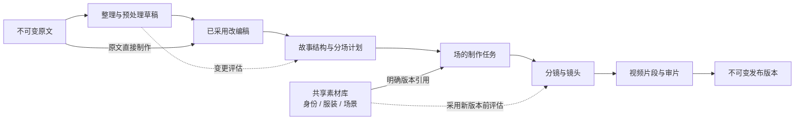

# 叙间工作台设计规范

版本：1.0 · 2026-10-02 · 状态：待实施的设计基线

本规范用于下一轮开发与验收，不代表下面的能力已经实现。配套文件：[实施计划与验收清单](implementation-plan.md)。

## 1. 产品定位与确定的设计方向

工作台是一个故事项目的制作空间。它需要容纳不同长度与结构的故事，支持制作前的内容处理、可复用的视觉素材、逐场制作和独立发布版本。

本轮确定以下规则：

- 基础对象是「故事项目」，页面、接口新契约和数据模型不再把「微小说」作为唯一类型。短篇、长篇、分集故事使用同一工作模式。
- 增加「整理故事」工作区，允许精简、扩展细节与调整叙述节奏。原文始终保留，采用后的改编稿才作为本次制作依据。
- 项目导航按用户要处理的对象组织。计算节点与专业模型节点继续独立执行，在制作记录中展示；不把所有节点平铺为必须顺序浏览的九步页面。
- 人物身份、独立服装、场景分别管理。跨场复用已有的具体版本；换服装不会创建第二个人物身份。
- 审核针对具体对象和具体版本。取消「我已看过本轮全部内容」这类总勾选；明确区分选中、保存、确认、生成、发布。
- 每次修改先计算影响范围。历史发布版本保留快照；新版本的采用范围由用户明确选择。
- 完整提供明暗双主题：亮色以当前工作台为基准，暗色以主页为基准，同一个组件使用同一组语义和几何规格。
- 本轮交付设计与实施计划，由开发者实施，完成后按文末及计划书的验收标准检查。

## 2. 对象关系与术语

| 名称 | 含义与边界 |
| --- | --- |
| 原文 | 导入的原始内容及原始章节，内容不原地修改。元数据编辑与正文改写分别处理。 |
| 改编稿 | 当前项目采用的故事文本版本。可以与原文完全一致，也可以经过预处理。 |
| 原文章节 | 来源文本的章节组织，用于阅读和追溯，不能自动等同于制作的集。 |
| 篇章／集 | 可选的制作组织层。一个原文章节可以跨多个集，一个集也可以引用多个原文章节。 |
| 场 | 有明确叙事目的、出场角色、主要物理场景和衔接状态的制作单元。换地点或时间通常需要分场，但由创作者确认。 |
| 镜头 | 场中的具体拍摄与生成规格，绑定人物、服装、场景的准确版本。镜头身份不由当前显示序号决定。 |
| 素材 | 人物身份、独立服装、场景等可复用资源。素材身份与素材版本分别记录。 |
| 制作任务 | 一次有确定输入版本与范围的计算操作，可以失败、重试、被新任务取代。任务完成不等于作者确认。 |
| 发布版本 | 固定的改编稿、分场、镜头、素材和视频快照，可发布完整作品或已完成的集／范围。 |

界面默认层级：`项目 → 篇章／集（可选）→ 场 → 镜头`。短故事可以直接分场，不显示空的中间层。长故事可以增加组织层，不能靠把全书塞进一个生成请求来扩展。

显示序号和标题允许调整，业务 ID 必须稳定。拆分、合并时保留来源与继承关系；调整顺序不能重新编号所有素材、镜头和媒体文件的业务 ID。

## 3. 项目工作模式与导航

### 3.1 项目入口

进入已有项目时恢复上次查看的工作区、场、素材与版本。第一次进入新项目默认打开「整理故事」，显示原文及制作范围选择；可以显式选择「直接使用原文」。

项目顶栏显示：项目名、当前采用的改编稿版本、当前查看的篇章／集／场、后台任务状态入口。后台任务完成不会自动跳转页面、改变当前选择或触发确认。

### 3.2 六个工作区

| 工作区 | 主内容 | 主要动作 |
| --- | --- | --- |
| 项目总览 | 项目结构摘要、当前需要处理的一件事、各场的真实状态 | 打开当前待办、进入指定场 |
| 整理故事 | 原文、处理范围与目标、调整草稿、差异与变更清单 | 预览调整、保存草稿、采用此版本 |
| 故事结构 | 篇章／集与场的树、当前场的原文来源、叙事目的、衔接 | 编辑、拆分、合并、调整顺序、确认分场版本 |
| 素材库 | 身份、服装、场景分类列表；所选素材的版本、使用位置与审核 | 确认此版本、创建新版本、采用到指定范围 |
| 分场制作 | 场导航、当前场的引用／分镜／审片、当前阻塞原因 | 确认分镜、生成本场视频、逐镜审片 |
| 版本发布 | 待发布范围、就绪检查、历史发布版本及快照 | 预览发布、创建新发布版本 |

「制作记录与设置」作为次级入口，按场和任务树查看。正常状态默认收起；存在失败、结果不确定或输入过期时，在当前内容区显示可处理的提示与直达入口。

### 3.3 布局与信息优先级

桌面采用「项目导航 + 当前对象工作区」。在分场制作中，内容区进一步采用「场列表 + 当前场」。所选对象的详细检查占主要空间，辅助信息按需展开，不把原文、全部素材、全部任务与全部历史同时堆在主内容区。

每个独立操作区只有一个主按钮。主按钮文案说明将发生的动作和对象，如「确认服装 v2」「生成第 2 场视频」，不能使用含义随状态变化的「继续」代替所有动作。

总览不使用虚构的总进度百分比。显示可追溯的状态，例如「第 2 场缺少已确认的服装引用」「3 个镜头中 1 个需修改」。项目存在多个待办时，以已选制作范围中的依赖顺序推荐一项，其余待办以列表进入。

## 4. 故事预处理

### 4.1 工作区内容

桌面并列显示原文与调整稿，使用对齐的段落与变化标记。窄屏使用「原文／调整稿／变化」切换，不能把长文本双列压缩到难以阅读。

处理表单包含：

| 项目 | 规则 |
| --- | --- |
| 处理范围 | 全文、选定章节、选定场对应的文本。范围显示实际章节／段落，不能只显示「局部」。 |
| 处理方式 | 精简内容、扩展细节、调整节奏；可以手动编辑草稿。首次不提供含糊的「一键优化」。 |
| 目标 | 可选目标长度或时长范围、希望补充／减少的内容，以及必须保留的事实与段落。目标是规划约束，不保证模型精确达到字数或视频时长。 |
| 创作边界 | 默认保留关键因果、人物关系和结局。允许改动这些要素时，必须明确标记，结果中单独列出。 |
| 输出 | 调整稿、删减／新增／改写清单、来源映射、待复核事实、预计制作范围变化。 |
| 采用 | 保存草稿不会替换制作依据；「采用此版本」先展示变更影响，再建立新的制作依据版本。 |

精简不能只按字数截断原文。扩展不能把新写的事件伪装成原文已有事实。必须把保留、删减、补写、重组分开记录。

### 4.2 来源与覆盖检查

每个调整稿段落有稳定 ID 和来源关系，支持一对多、多对一与新增内容：

- 保留／改写：引用原文段落 ID 与范围。
- 新增：标记为补写，记录关联上下文；不能编造一个原文 P 编号证明它来自原文。
- 删减：保存被删范围与删减理由，在差异列表可查看。
- 重组：保留新的顺序与原文来源，不依赖原文段落始终连续这一假设。

分场覆盖校验针对「已采用改编稿」的制作范围。删掉的原文不要求再次分配到场；新增的改编稿内容必须有归属。未制作的章节标记为范围外，不能被统计为漏掉的正文。

保留一个未经预处理的直接制作路径：建立与原文相同内容的已采用改编稿，并记录来源，而不是跳过版本与来源机制。

### 4.3 变更与任务规则

预览、编辑、保存草稿均不生成视觉素材。采用调整稿也不隐式开始生图或视频生成。

如果项目已有分场／素材／视频，采用前展示：变动文本、受影响的场、需要重新核对的分镜／片段、新增人物或物理场景、保留的历史发布。用户确认后建立新版本，并标记需复核的下游对象；不删除历史产物。

取消采用保留当前使用版本。已有任务继续使用提交时冻结的输入；迟到的结果不能覆盖后来采用的故事稿。

## 5. 故事结构与分场

分场先解决故事要讲什么，再准备需要的素材与镜头。全书大纲用于总体理解，具体场／镜头任务只读取选定范围、关联角色设定与必要的前后衔接。

当前场的编辑内容至少包含：标题、叙事目的、采用稿来源、出场角色、主要地点／时间、开始状态、结尾状态、预计镜头预算。预算与生产服务的单次限制分开，不给整部作品固定 24 镜上限。

必须支持：

1. 编辑一场的内容与目的。
2. 在明确的文本／事件边界拆为两场，预览两场各自的来源与承接。
3. 合并同一制作组织范围内的相邻场；跨集或非相邻合并需要先重新组织范围并说明衔接，不能悄悄执行。
4. 调整场顺序，并复核相邻场的因果与视觉连续性。
5. 对照分场来源，发现遗漏、重复和不合理的跨场衔接。

编辑期间显示「未采用的结构草稿」。采用结构变更与确认分场是两个动作：前者更新结构版本及影响标记，后者确认这一版分场计划。两者都不隐式生成素材。

结构总版本升级时，未变场继承原对象与有效确认；重新核对的范围由场的内容及依赖摘要决定，不能因为总版本号变化清空全部确认。

拆分或合并时只使对应场的生产计划过期；相邻场的入口／出口状态需要复核，不能因此直接删除相邻场全部已完成视频。已发布内容保留在原发布版本。

## 6. 共享素材与复用

### 6.1 素材层次

| 类别 | 设计规则 |
| --- | --- |
| 人物身份 | 一个人物有一个稳定身份对象，保存外貌特征和各版本。姓名变化、换衣服或跨场出现不产生另一个人物。 |
| 独立服装 | 一套服装有自己的记录，绑定所属人物身份。身份图与服装图分别确认；同一人物在不同场可以引用不同服装。 |
| 场景 | 物理空间的稳定设定与版本。场的叙事内容和场景素材不能混为同一个对象。 |
| 引用组合 | 人物身份版本 + 服装版本 + 场景版本的绑定关系，用于镜头；不是新增的定装合成或试拍生图步骤。 |

本期必须实现项目内跨场复用，预留跨项目来源记录。跨项目素材推荐与全站共享库后续实施，不作为本期验收前提。

保留当前 `garment`／`bare` 的明确结论。适用的自然体表角色无需服装图，但必须有可查看的服装模式结论；不能用一张空图伪装服装产物。

### 6.2 素材详情

选中素材只改变查看对象。详情展示大图／规格、当前版本、审核状态、所属身份、被哪些场／镜头引用及准确版本、修改历史。

审核操作使用「确认此版本」和「提出修改」。已确认后可以创建新版本。新版本初始为待审核，原来已确认的版本及引用不自动改为新版本。

「确认新版本」不等于「让全部场采用新版本」。另设「采用到…」，选择当前场、指定场或全部适用的未发布草稿。提交前显示真实受影响列表；已经发布的快照不自动更新。

多个镜头引用同一人物与同一服装版本时直接复用。一个镜头中的一个人物只能绑定一套服装；不能把同一身份的两套服装当成两个出场人物。保持现有参考图数量校验和超限时的本地参考板处理，不恢复已废弃的定装、试拍和逐镜生图流程。

## 7. 分场制作与审核

### 7.1 当前场的工作内容

「引用」「分镜」「审片」是同一场的三个查看页签，不是三个互相吞并的计算节点。查看任何已存在的产物不会改变实际制作进度。

| 页签 | 必须显示 | 推进条件 |
| --- | --- | --- |
| 引用 | 人物身份、独立服装、场景的准确版本及其确认状态；缺失／过期原因 | 场结构已确认，必要引用已确认且版本有效 |
| 分镜 | 镜头目的、构图、动作、对白、来源、连续性、引用版本；专业预审意见 | 分镜结构校验通过，作者确认具体分镜版本 |
| 审片 | 当前镜头的视频、对应分镜、实际采用的引用、逐镜状态与修改记录 | 所选发布范围的每个必要镜头已人工确认 |

「确认分镜」保存作者确认；随后显示「生成本场视频」。不把确认与付费生成藏在同一次含糊点击中。生成前显示范围、要新建的任务与服务端可提供的费用估算；估算缺失时显示缺失，不伪造数字。

专业模型预审、结构校验、图像／视频任务完成、作者确认是不同状态。AI 预审不能自动勾选作者满意，任务完成不能自动发布。

### 7.2 状态设计

不要用单一阶段字段覆盖所有状态。至少分别维护：

- 任务：未排队、排队、执行、等待供应商、成功、明确失败、结果待核实、已被取代。
- 作者审核：未审核、已确认、要求修改。
- 输入有效性：当前有效、引用变化需复核、版本不匹配。
- 发布：草稿、已加入发布范围、已发布于某个固定版本。

UI 可以把这些状态组合成简短标签，但必须允许查看原因。「需复核」与「失败」不可混用。

每次确认记录对象 ID、对象版本及依赖摘要。刷新、回看和切换对象后确认仍然存在；当前版本变化则该版本重新审核。只修改一个视频镜头时，保留其他有效镜头的确认。

### 7.3 并行与长故事

项目导航允许先整理后续章节、复用素材、回看已完成场。后台执行受依赖、服务限额与预算控制，不能把「可查看」错误实现为「可无条件生成」。

首期按选定场生成，支持场内有限并发与任务树。跨场依赖真实前一镜尾帧或连续性状态时必须等待对应输入，不能为提高并发而绕过依赖。大规模批量执行作为后续能力，数据模型先保留队列范围。

## 8. 变更影响规则

| 变更 | 需要复核／重建的对象 | 应保留 |
| --- | --- | --- |
| 尚未采用的故事草稿 | 无下游影响 | 当前制作依据及全部产物 |
| 采用局部故事改写 | 引用该范围的场；相邻衔接；受事实变化影响的后续场 | 无关场、原文、旧改编稿、发布快照 |
| 拆分／合并／重排场 | 对应场的分镜；相邻场的衔接；镜头编排 | 不相关场及其镜头、视频文件 |
| 创建或确认素材新版本 | 尚未采用前，不改变现有引用 | 正在使用的已确认旧版本 |
| 把素材新版本采用到场／镜头 | 采用范围内依赖该素材的分镜和视频 | 其他身份／服装／场景、未采用的新范围、历史发布 |
| 修改一个分镜 | 此镜头的提示词、视频；必要的相邻连续性 | 其他有效镜头及其审核 |
| 修改一个视频 | 此片段新版本与审核 | 分镜、素材、其余视频 |
| 改变全项目视觉方向 | 相关视觉素材与全部采用新风格的下游；先显示范围 | 原文、改编稿、旧风格产物及发布快照 |

局部文本改写的影响不能只看段落 ID：人物生死、知识、道具归属、地点或时间变化可能影响后续场。无法准确判断时显示需人工复核的候选范围，不能宣称「只影响这一场」。

变更预览必须区分：已确定依赖、需人工复核的叙事影响、仍可保留的产物。失效标记与物理删除分开；本规范的普通创作修改不删除历史文件。

运行中的任务固定输入版本。应用变更后，旧结果可进入历史记录但不得覆盖当前选用结果。服务端应验证项目、对象版本、输入摘要、任务 ID 与当前选用关系。

## 9. 按钮、点击行为与发布

| 操作 | 表现 | 点击结果与门槛 |
| --- | --- | --- |
| 浏览故事市场 | 文字锚点 + 向下箭头，至少 44px 点击目标 | 定位主页市场区域，保留筛选；键盘可到达并定位内容。不是导入按钮的第二个主按钮。 |
| 导入故事 | 全站统一按钮与独立导入页 | 创建不可变原文，随后进入新项目的整理故事。主页只有这一组创作主入口，不重复内联大表单。 |
| 选择场／素材／镜头 | 导航行或卡片的选中态 | 只选择对象；不审核、不保存、不生成。 |
| 预览调整方案 | 表单主按钮 | 创建调整草稿任务；原文与采用稿不变。运行中禁用重复提交。 |
| 保存草稿 | 次按钮或编辑区的主按钮 | 保存当前文本与版本草稿，不推进生产。 |
| 采用此版本 | 调整稿审核区主按钮 | 展示影响范围后，明确采用新的制作依据。 |
| 确认分场 | 分场审核区主按钮 | 确认当前结构版本，不自动生图。 |
| 确认素材／镜头 | 当前对象的主按钮 | 持久化当前版本及依赖的人工确认，可自动显示下一个未审核对象；不能自动生成下一阶段。 |
| 提出修改 | 次按钮 | 展开当前对象的修改区；取消保留原结果，提交创建新草稿／任务，结果仍待审核。 |
| 采用素材版本到… | 次按钮，随后范围页主按钮 | 只对明确选定的草稿范围改变引用，显示重算与复核清单。 |
| 生成分镜／视频 | 当前任务主按钮 | 门槛满足后建立明确范围的新任务，不隐含确认其他对象。 |
| 继续任务 | 恢复入口次按钮 | 使用已保存且有效的输入续跑；存在失败／待核实结果时显示对应处理入口。 |
| 重试失败项 | 具体失败项次按钮 | 仅处理失败项；结果不确定时先核实原请求，不能盲目新发一单。 |
| 创建新发布版本 | 发布检查区主按钮 | 明确范围全部就绪后建立新快照；原发布版本不覆写。 |
| 清空／删除／整轮重做 | 危险操作区 | 独立入口、影响范围和确认页，不能与重试共用按钮或显示同样的普通主色。 |

审核无需事先勾选「我同意」。主按钮本身就是明确的确认动作。范围选择可以使用标准选择控件，但必须在视觉和数据上与审核状态分离。

禁用按钮旁显示具体缺少的条件以及修复入口，例如「服装 v2 尚未确认 → 去审核」。没有就绪对象的按钮不能仅降低透明度而不解释原因。

生成／修改任务提供正在处理、明确成功、失败、待核实四类反馈。后端只有任务排队回执时，页面不能显示「已完成」。重复点击使用服务端幂等键；前端禁用按钮不能代替幂等。

发布页显示本次场／集范围、选用镜头版本、素材依赖与未就绪原因。首期可以发布已完成范围；未发布的后续场不会被迫自动生成。

## 10. 视觉系统

### 10.1 双主题语义色

| 语义 | 白日 | 暗夜 |
| --- | --- | --- |
| 页面背景 | `#f7f7f3` | `#11191d` |
| 主表面 | `#ffffff` | `#192522` |
| 次表面 | `#f0f3eb` | `#202c25` |
| 主文字 | `#293e32` | `#f3eee2` |
| 次文字 | `#64745b` | `#a2b39a` |
| 结构边界 | `#dce3d6` | `#344339` |
| 主动作背景 | `#365139` | `#c9dfab` |
| 主动作文字 | `#f0f5e6` | `#1c3022` |
| 主动作悬停 | `#29432d` | `#d7eaba` |
| 选中背景 | `#edf3e6` | `#26382b` |
| 待处理背景／文字 | `#f7eddb` / `#86572f` | `#3b3023` / `#e7c398` |

危险与错误另外定义语义色并实测对比度。选中、完成、待审核、错误均配文字／图标，不能仅用颜色区分。

颜色在共享 token 中定义，导入、市场、工作台、弹层和表单都从同一来源读取。亮色时不出现暗色遗留面板；暗色时不出现亮色白底表单。主题为站点级偏好，可选择白日、暗夜、跟随系统，切换与刷新保持偏好并避免首屏闪错主题。

### 10.2 组件与尺度

| 项目 | 规格 |
| --- | --- |
| 内容宽度 | 项目壳铺满可用宽度；编辑主体在大屏保持可读行长，主要工作区最大约 1280px，双列素材／分镜按任务调整。 |
| 导航 | 桌面项目栏约 184–216px；分场对象导航约 180–240px；主要内容始终是最大一列。 |
| 按钮 | 统一最小高度 44px、圆角 8px、图标 16px、文字 14px；主／次／文字／危险四种语义，禁止各页自由拼样式。 |
| 面板 | 默认圆角 20px；用留白和轻边界区分，不层层套框；辅助信息常用分隔线和折叠区。 |
| 表单 | 文本框和选择框最小高度 44px，移动端编辑字体至少 16px；标签明确且不只依靠占位符。 |
| 字体 | 正文使用系统中文无衬线；主页故事标题可用现有宋体风格。操作区避免把装饰标题样式扩展到所有控件。 |
| 排版 | 正文 14–16px，辅助文字不低于 12px；工作区标题 24–28px，保持层次而非多个同等大的标题。 |
| 间距 | 以 4/8px 为基础，常用 8、12、16、24、32；同类按钮和同类表单使用相同节奏。 |

导入页是阅读／编辑型布局，不与主页封面光晕共享一个被裁切的背景容器。主页氛围光与封面分层，不能在区块边缘突然形成硬切割。

### 10.3 响应式

- 1440–1920px：主体适度居中，详情拥有足够宽度，不把一行按钮拆成多排，辅助区不要无限变宽。
- 1024px：项目导航与一个主体保留；次级详情改折叠或单列，不能同时塞下两级侧栏和多个小面板。
- 768px 附近：项目导航改紧凑分组，场／素材导航置于当前内容上方。
- 320–430px：单列，先显示对象、阻塞原因与主要动作；原文对照用页签；列表与按钮自然换行，不产生页面横向滚动。

空、长标题、很多章节、多人物、失败提示、打开修改表单都要参与响应式检查，不能只检查默认静态页面。

### 10.4 动效与可访问性

动效用于解释状态和位置变化：按钮反馈约 120–160ms；对象切换／修改区展开约 180–240ms；页面内容切换约 220–280ms。使用透明度和小幅位移，不循环漂浮，不以发光代替选中或确认。

动效不改变审批、任务和数据状态。任务运行只显示真实阶段或不确定等待，不伪造增长的百分比。`prefers-reduced-motion` 下移除非必要过渡与平滑滚动。

键盘能完成导航、编辑、确认和取消；保留可见焦点。打开修改区定位到编辑内容，取消后回到触发按钮。动态完成／失败使用状态播报，不把整个任务列表反复朗读。图片／视频具备可识别的对象名称。

## 11. 拟新增的数据契约

以下为下一版契约要求，具体存储可沿用当前 Record／Task 基础。不要先在前端伪造已经持久化的版本与确认。

| 对象 | 必须记录的核心信息 |
| --- | --- |
| AdaptationDraft | project_id、稳定 draft_id、revision、原文版本／hash、范围、处理目标、段落列表、来源映射、变化清单、审核与采用状态 |
| ProductionStructure | project_id、revision、adopted_draft_id/revision、可选分组、稳定 scene_id、显示顺序、来源、目的与衔接 |
| Asset / AssetRevision | 稳定 asset_id、种类、人物所属关系、不可变 revision、结构化规格、图片文件摘要、审核状态、来源任务 |
| AssetBinding | scene_id/shot_id、身份／服装／场景角色、asset_id、asset_revision、采用范围与依赖摘要 |
| ShotRevision | 稳定 shot_id、scene_id、revision、结构版本、叙事与构图规格、引用版本、连续性、审核 |
| ClipArtifact | clip_id/revision、shot_id/revision、冻结输入摘要、媒体与校验、选用状态、作者审核 |
| ReviewDecision | 对象类型、ID、revision、依赖摘要、确认／要求修改、时间与意见引用 |
| ChangeImpact | 基准版本、拟变更内容、确定依赖、叙事复核候选、采用范围、失效／保留列表 |
| Task | 幂等键、项目和对象范围、input_revision/input_digest、执行状态、供应商请求编号、结果来源 |
| ReleaseManifest | release_id/revision、范围、改编稿／结构／分镜／素材／视频快照、文件摘要与发布时间 |

预览变更和应用变更之间校验 expected_version。期间有人或任务更新了输入则要求重新计算预览，不能用旧清单盲目应用。

## 12. 当前代码基础与必须补齐的差异

| 已有证据 | 本轮处理 |
| --- | --- |
| `backend/story_sources.py`：按正文 hash 保存本地原文；正文 2MB、上传 4MB 限制 | 保留原文机制；新建项目级改编稿。更大导入能力另行规划，不能宣称无限长度或直接移除资源校验。 |
| `backend/segments.py`：连续原文范围，10 段、每段 6 镜、全篇 24 镜 | 新版把逻辑作品结构与单次计算窗口分开，增加采用稿的来源契约；旧版限制继续用于旧流程，新流程需独立版本与迁移。 |
| `backend/asset_workflow.py`、`preproduction.py`：身份／服装关系、快照、准确引用与局部失效 | 沿用资产身份规范；补充并存版本、显式采用范围和变更预览，不能仅用「当前最新版」替换旧引用。 |
| `web/app/author/page.tsx`：总 confirmed、阶段导航、素材与审片、反馈 | 拆为工作区与对象状态；服务端持久化逐版本确认，解除选中与审核的耦合。 |
| `backend/authors.py`：分场确认、节点恢复与整轮重做 | 保留继续／重试／重做的区别；新变更采用不得隐式调用整轮重做，普通修改不删历史发布。 |
| `backend/workflows.py`：v7 专业制作节点 | 新工作模式以新版本契约演进；保留专业节点职责和参考视频规则，不恢复已废弃的中间生图节点。 |

旧项目只能在能准确映射时迁移为新版工作区。保留原 ID、媒体和发布；映射不完整时提供历史查看及明确的新版副本入口。不能重新提交历史供应商任务来补齐展示。

## 13. 验收原则

完整验收用例见[实施计划](implementation-plan.md#6-验收清单)。验收同时检查操作行为、持久化版本、依赖影响、界面层次、双主题与真实生产路径。仅有截图或前端状态变化不能视为完成。

必须能通过一条完整路径：导入不同形态故事 → 精简或扩写并检查差异 → 采用稿与分场 → 跨场复用同一人物及不同服装 → 逐版本审核 → 逐场制作／逐镜审片 → 发布选定范围 → 修改一项素材，明确影响范围并保留旧发布。

未来跨项目素材推荐、多人协作、超大规模排程、独立配音混音不在本期完成范围。数据关系预留接口，UI 不出现没有真实行为的可点击功能入口。
