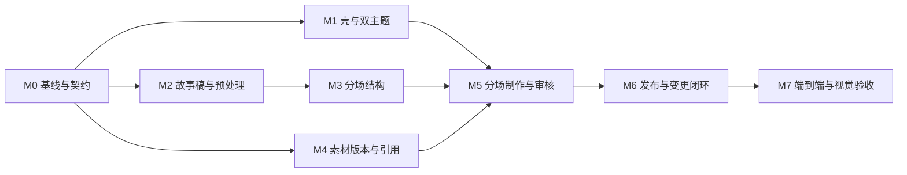

# 工作台实施计划与验收清单

版本：1.0 · 2026-10-02 · 状态：待开发

设计基线：[叙间工作台设计规范](design-spec.md)。本文件安排实施顺序与交付证据，不包含已经完成新功能的声明。开发完成后，按本清单验收；不安排自动跟踪或未经请求的后台执行。

## 1. 实施范围与工作方式

本期完成项目工作区、故事预处理、可伸缩故事结构、项目内素材复用、逐版本审核、分场制作和发布快照。明暗双主题与按钮规则从第一批组件开始统一。

先完成数据与版本契约，再连接真实交互。每个里程碑独立可验收，不能以一个巨大页面替换现有工作台后再补状态逻辑。

已有未提交的 UI 调整需要保留并单独识别。开始开发前记录 Git 状态与已有行为，不把现有改动误当成本计划的实施结果。

## 2. 里程碑与依赖



M1、M2、M4 可以在契约确定后独立推进；它们共享版本字段、确认模型与组件规范。顺序依赖未满足时可以完成界面结构，但不能宣称真实流程已通。

### M0 · 基线、术语与迁移方案

**工作内容**

- 盘点 author、director、creative、preproduction、production 与 Task 的实际状态转换，不仅依赖页面阶段名或工作流元数据。
- 固定原文、改编稿、结构、场、镜头、素材版本、确认、发布的契约；记录现有 ID／段号与新稳定 ID 的映射。
- 确认新流程版本及兼容读取策略。旧流程不直接放宽全局校验来冒充长故事支持。
- 建立固定的本地验收数据：短故事、分章节故事、分集故事、多服装角色、已发布后修改、失败与结果不确定任务。

**出口标准**

模型关系与状态转换可审查；旧项目读取、发布和任务恢复有兼容策略；验收样本可重复加载。尚未执行供应商付费任务也能验证接口与状态。

### M1 · 项目壳、设计系统与市场入口

**工作内容**

- 统一双主题 token、四类按钮、表单、状态标签、对象导航、版本标签与可见焦点。
- 建立六个项目工作区的壳、路由／本地查看状态、选择恢复与后台任务入口。
- 总览突出当前待办；任务日志、原文与设置转为次级信息，不再同时平铺。
- 主页「浏览故事市场」使用页内锚点，导入使用统一独立页面；区块光晕和表面衔接重做。
- 整站文案以「故事」为通用类型；允许实际故事标签包含「微小说」，但不能把所有输入与制作单位限制为微小说。

**出口标准**

同一组件在两种主题中尺寸与行为一致；切换、刷新没有错误主题闪烁；320、390、768、1024、1440、1920px 下主要内容和操作可用；导航不触发生产任务。

### M2 · 故事稿与预处理

**工作内容**

- 新增项目级改编稿及来源映射，原文 hash 与内容保持不变。
- 实现范围选择、精简／扩写／节奏调整目标、受保护事实与人工编辑。
- 对处理任务保存输入版本、幂等键、输出文本、变更清单与审核状态。
- 实现差异查看、保存草稿、直接使用原文、采用新稿及变更预览。
- 处理新增内容、删减范围与重组，明确采用稿覆盖校验，不沿用「原文全部段落必须连续覆盖」作为所有模式的唯一标准。

**出口标准**

精简与扩写真实产生可复核的结果；保存不改变采用稿；采用不隐式生图；错误／超时／过期结果不会替换当前依据；原文不丢失。目标长度显示为目标或测量结果，不冒充已经保证的输出。

### M3 · 故事结构与分场编辑

**工作内容**

- 实现可选制作分组与稳定场 ID，显示序号与业务 ID 分离。
- 短故事可直接分场，分章节／分集故事按选定范围规划。模型执行按窗口进行，作品总结构不受旧 10 段／24 镜限制。
- 实现场目的、人物、地点、来源、入口／出口连续性与预算编辑。
- 提供拆分、相邻合并、重排及来源覆盖检查；先预览再采用。
- 采用结构变更时更新依赖标记，确认分场另行保存，不自动生成下游素材。

**出口标准**

跨章节来源关系清楚；拆分／合并不重编号无关场与镜头；已生成范围的影响清单正确；相邻衔接复核与整场重做分开；可处理超过旧总镜头上限的逻辑计划而仍遵守单次服务限制。

### M4 · 共享素材、版本与采用范围

**工作内容**

- 复用现有身份／服装／场景规范与参考图规则，建立素材版本列表和使用位置查询。
- 同一人物支持多套独立服装；同一身份与服装版本支持跨场复用。
- 服务端保存具体版本的审核；新版本不自动替换现有镜头引用。
- 实现「采用到当前场／指定场／适用的未发布草稿」及影响预览。
- 保留自然体表的服装模式结论、本地拼接参考板与准确依赖，不新增定装合成／试拍／逐镜生图。

**出口标准**

创建、确认、采用三种动作各自可验证；刷新后确认保持；一个角色换服装不会变成另一个人物；只有实际采用的新版本引发对应下游复核；旧发布不变。

### M5 · 分场制作与逐对象审核

**工作内容**

- 将 author 页面拆为选择上下文、引用检查、分镜、审片和次级任务记录；保留专业计算节点独立职责。
- 实现逐版本确认，移除总 confirmed 勾选机制；将范围选中状态与作者审核分开。
- 「确认分镜」与「生成本场视频」分开，生成入口由服务端就绪检查决定。
- 状态细分为执行、审核、有效性和发布，不将任务完成等同于作品确认。
- 局部修改只产生局部新版本；其他有效确认保留。后台响应不抢焦点、不自动跳页。
- 确认／生成／修改操作具有重复提交保护，失败、待核实、过期输入均能恢复。

**出口标准**

一场从引用到分镜到成片可完整操作；未就绪按钮有具体修复入口；只改一项不会清空全部审核；刷新、回看、前后导航和迟到响应均正确。

### M6 · 发布与变更闭环

**工作内容**

- 发布页支持选择已完成的场／集范围，展示所有就绪条件及实际选用版本。
- 创建不可变发布快照；新素材、新稿、新结构只作用于明确采用的草稿范围。
- 对变更预览和应用加入 expected_version，过期预览需重算。
- 区分原文改写的确定依赖与叙事影响候选；处理后续知识、道具、地点等事实变化。
- 明确继续／重试／待核实／整轮重做的行为，普通修改不调用删除型重做。

**出口标准**

发布后继续制作或改稿，旧版本仍可播放且引用不变；新发布版本可区分；部分失败不会进入发布；输入版本变化时无法用旧预览应用修改。

### M7 · 验收与收尾

**工作内容**

- 执行下方用例、当前相关回归与类型／构建检查。
- 真实浏览器点击验证双主题、全断点、键盘、减弱动态偏好与长内容。
- 对生产路径完成小范围实测。付费任务需在已授权的测试范围内执行，记录真实任务与产物；不能以 fixture 或录屏冒充真实执行。
- 完成旧项目兼容检查与必要的数据迁移说明，整理截图、操作证据、命令结果和未覆盖项。

**出口标准**

所有必需用例通过；没有阻塞数据错误、混搭主题、丢失确认或旧发布被改写；未实现的后续功能无误导入口。

## 3. 建议修改位置

以下是拆分建议，不要求照搬文件名；职责边界必须保留。

| 区域 | 现有位置 | 建议职责 |
| --- | --- | --- |
| 原文与改编 | `backend/story_sources.py`、`director.py`、`authors.py` | 原文读取与新改编稿服务分离；导演任务明确采用稿版本和范围 |
| 结构与单元 | `backend/segments.py`、`production_nodes.py`、`workflows.py` | 新版结构契约、计算窗口、稳定 ID、结构编辑与旧版兼容 |
| 素材与影响 | `backend/asset_workflow.py`、`preproduction.py`、`consistency.py` | 并存版本、精确绑定、确认和影响分析；保持图片引用规则 |
| 镜头与发布 | `backend/production.py`、`video_storage.py`、`worker.py` | 冻结任务输入、逐镜选用与审核、发布快照和过期回包隔离 |
| 项目工作区 | `web/app/author/page.tsx`、`SegmentReview.tsx`、`AssetRedesign.tsx` | 工作区壳、故事编辑、结构详情、素材详情、场内制作与审核拆分 |
| 进度与恢复 | `ProductionProgress.tsx`、`production-progress.css`、相关接口 | 真实状态与处理入口，任务树作为辅助，不覆盖当前编辑对象 |
| 视觉与入口 | `globals.css`、`ui-controls.css`、`ui-motion.css`、`author.css`、`ReaderHero.tsx`、`StoryImport.tsx` | 共享主题和组件规则、市场锚点、独立导入、响应式与动效 |

不要把整个工作台改写成一个状态对象加大量条件渲染。查看状态由 UI 管理，审核／引用／任务就绪由服务端持久化与验证。

## 4. 开发提交建议

按里程碑分批提交，每批附实现范围、契约变化和证据。任何破坏兼容的模型调整先提供迁移／回退路径。

建议每批说明：

1. 实现了哪些规范条款与验收用例。
2. 涉及哪些数据结构、接口与状态转换。
3. 已执行的检查与真实结果。
4. 当前未接通或仅有 fixture 的部分。
5. 现有项目和历史发布的兼容情况。

不要求以固定天数推进：M0 的实际差异决定后端改造量。避免先承诺时间，再以删减版本或来源机制赶进度。

## 5. 验收数据与证据

| 样本 | 需要覆盖的情况 |
| --- | --- |
| A · 短故事 | 无章节，直接分场，可跳过预处理，至少一条完整制作与发布路径 |
| B · 分章节故事 | 多章节、跨章节改编来源、超过旧总镜头限制的结构计划、只处理选定章节 |
| C · 分集故事 | 原文章节与制作集不同，部分集发布，后续集尚未制作 |
| D · 人物复用 | 同一人物两套服装，至少两个场复用同一版本；另一个场换服装 |
| E · 局部修改 | 发布后新建素材版本、仅采用到一场、检查受影响与保留范围 |
| F · 恢复与并发 | 明确失败、超时结果未知、离线刷新、过期响应、重复提交、预览后版本变化 |
| G · 界面压力 | 长标题、很多场、多角色、打开修改区、无封面、空项目、错误长文本 |

截图矩阵至少包含：主页／导入、故事预处理、故事结构、素材详情、分场制作、发布检查；分别检查白日和暗夜，390、1024、1920px 保存截图，其他断点记录布局结果。

行为证据必须包含操作前后的对象／版本／引用／审核及发布摘要。生产证据包含任务 ID、输入版本摘要、产物及来源类型。任何自建测试数据都标记为 fixture。

## 6. 验收清单

以下复选框用于文档中的实施跟踪，不代表产品的审核交互。

### 故事与预处理

- [ ] A01 短篇、分章节与分集故事均能创建项目，工作台不强制使用「微小说」类型。
- [ ] A02 直接使用原文也建立明确的制作依据版本。
- [ ] A03 精简、扩写、节奏调整分别有范围、目标与可复核的变化清单。
- [ ] A04 原文内容与 hash 在处理、编辑、保存、采用后不变。
- [ ] A05 保存草稿不改变采用稿；采用前能取消并保留旧依据。
- [ ] A06 新增内容标记为补写，删减有记录，重组保留来源；没有伪造原文引用。
- [ ] A07 已有制作时采用新稿显示实际影响；事实变化会提示后续叙事复核。
- [ ] A08 处理失败／结果不确定／过期输出不会自动成为采用稿，不产生无授权的重复请求。

### 分场结构

- [ ] B01 短故事无多余分组层，长故事有可选篇章／集，来源章节与制作集可独立映射。
- [ ] B02 分场具备目的、来源、角色、地点和衔接信息，采用稿的范围无意外遗漏或重复。
- [ ] B03 拆分、合并、重排有预览；无关对象业务 ID 和媒体引用不改变。
- [ ] B04 结构采用与确认分开，确认不自动开始生图。
- [ ] B05 局部调整的镜头失效与相邻连续性复核可区分；无关已完成场保留。
- [ ] B06 超过旧总镜头限制的结构计划可保存和按窗口执行，单次模型／供应商限制仍受校验。

### 素材复用与确认

- [ ] C01 同一人物两套服装保持同一个身份；服装归属明确，不将衣着版本当成新人物。
- [ ] C02 跨场复用相同素材版本，查看使用位置能追到实际镜头。
- [ ] C03 选中对象与审核无关；确认针对准确版本和依赖摘要，并在刷新后保留。
- [ ] C04 创建／确认新版本不会自动替换旧引用；采用范围可预览与取消。
- [ ] C05 采用到一场只影响实际依赖，其他有效确认不清空。
- [ ] C06 服装模式与参考图规则仍有效，未恢复已废弃的中间 AI 生图流程。

### 制作、恢复与发布

- [ ] D01 缺少必要条件时生成按钮给出具体原因和修复入口，服务端也拒绝不满足门槛的请求。
- [ ] D02 确认分镜与生成视频是两个明确动作，费用／任务范围不藏在普通查看行为中。
- [ ] D03 逐镜审片与局部修改生效，修改单项保留其他有效镜头的确认。
- [ ] D04 任务、审核、输入有效性和发布状态不互相冒充；AI 预审不会自动确认成片。
- [ ] D05 刷新、回看、浏览器前后与后台完成不抢当前对象或丢失选择。
- [ ] D06 重复提交具备服务端幂等；结果不确定先核实；旧回包只能进入正确版本／历史。
- [ ] D07 继续／重试／整轮重做行为不同；普通改稿／改素材不调用删除型重做。
- [ ] D08 只发布已就绪范围，未完成后续不会自动生成或进入发布。
- [ ] D09 修改后旧发布仍可播放、依赖不变；新发布有新版本与完整快照。
- [ ] D10 变更预览过期时应用被拒绝并要求重算，不能错误复用旧影响清单。

### 视觉与操作

- [ ] E01 白日／暗夜的全站页面、表单、弹层、状态和按钮完整一致，没有混搭表面。
- [ ] E02 每个操作区一个明确主动作，按钮尺寸、圆角、图标、状态和点击目标一致。
- [ ] E03 工作台默认突出当前对象和动作，原文／进度／历史不与主内容争抢层级。
- [ ] E04 市场浏览是有效锚点，导入是一致入口，封面氛围光没有区块硬切割。
- [ ] E05 320、390、768、1024、1440、1920px 无内容覆盖、控件遮挡或页面横向溢出。
- [ ] E06 长内容、空状态、失败提示和修改表单仍满足响应式规则。
- [ ] E07 键盘与可见焦点可完成关键操作；动态状态有合适播报；颜色不是唯一信息。
- [ ] E08 动效与真实动作一致，减弱动态偏好有效，没有循环装饰或虚假进度。

### 兼容与工程检查

- [ ] F01 旧项目能读取与回看；迁移保留原 ID、媒体及发布，无法准确迁移的项目有明确历史路径。
- [ ] F02 不为迁移或补齐展示重放已提交供应商任务。
- [ ] F03 相关后端回归与新增契约行为测试通过，前端测试／类型检查／构建通过。
- [ ] F04 小范围真实制作闭环通过；fixture、接口验证与真实生成的证据分别标记。

## 7. 建议验证命令与回归范围

命令是开发完成后的检查要求，本次文档交付不把它们记作已运行。

```sh
# 在 web/ 执行，使用项目配置的 pnpm 版本
pnpm test
pnpm typecheck
pnpm build

# 在仓库根目录，使用项目后端环境
python -m pytest tests/test_story_sources.py tests/test_storyboard_segments.py tests/test_identity_workflow.py tests/test_preproduction.py tests/test_version_binding.py tests/test_image_replacement.py tests/test_stage_recovery.py tests/test_production.py tests/test_video_storage.py tests/test_author_step_navigation.py
```

上述为现有回归入口。新增改编稿、来源映射、结构编辑、并存版本、逐版本确认、影响预览、幂等与过期回包需要增加有实际行为意义的测试；不能仅测试函数存在或 CSS 包含某个字符串。

完成相关检查后再补真实浏览器与生产证据。测试结果与设计规范冲突时，先判断是旧流程兼容要求还是已被新版明确替代的行为，再更新对应断言；不能直接删掉失败测试。

## 8. 验收结论与缺陷等级

| 等级 | 示例 | 处理 |
| --- | --- | --- |
| 阻塞 | 原文丢失、旧发布被改写、错误版本入片、重复付费请求、无关场被删除 | 不通过，修复后重新验证相关闭环 |
| 主要 | 预处理未接真实链路、复用／确认无持久化、按钮行为含糊、主题混搭、移动端主操作不可达 | 不通过，补齐行为与证据 |
| 次要 | 非关键间距、文案、动效或次级信息层级偏差 | 记录明确对象与复验项，不能掩盖主要问题 |

最终报告分别说明：通过的流程、发现的问题、代码／界面定位、测试证据与尚未覆盖的真实条件。完成条件是规范内本期能力可用且证据齐全，不是仅完成页面外观。
